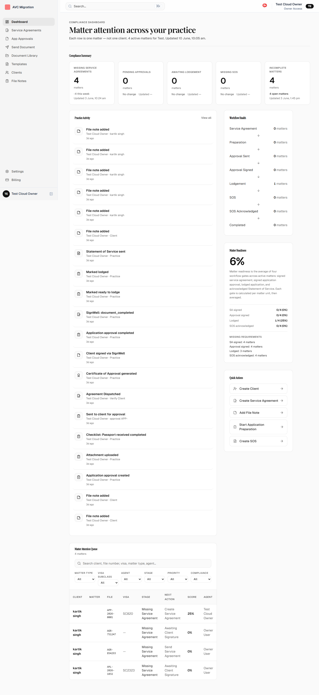
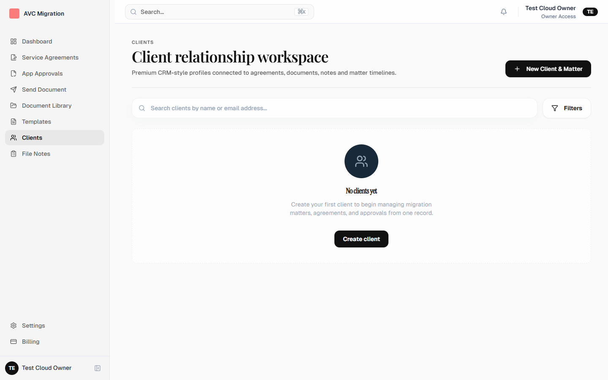
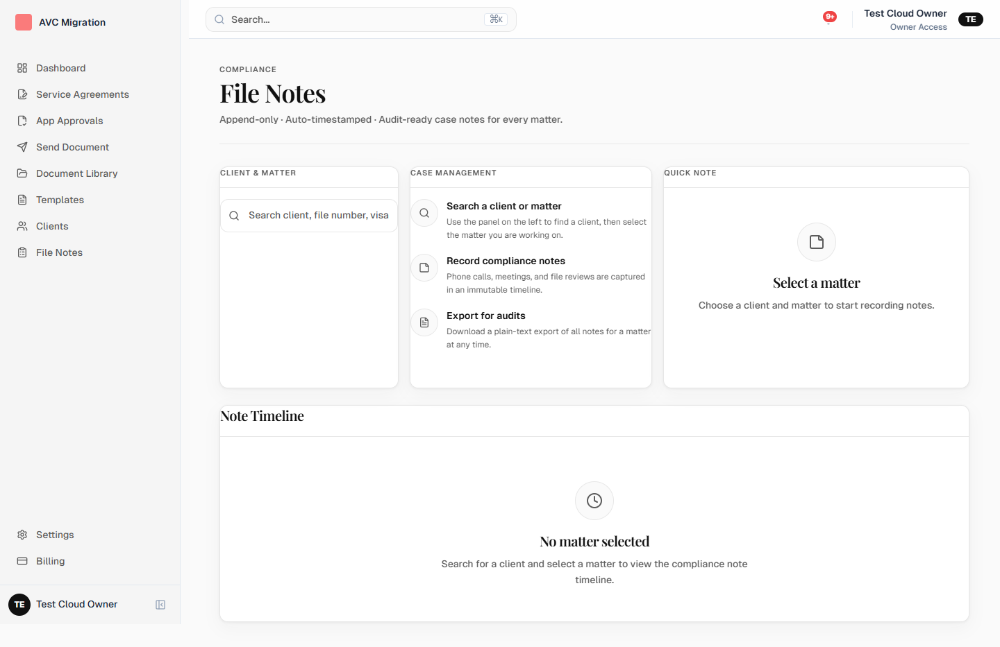
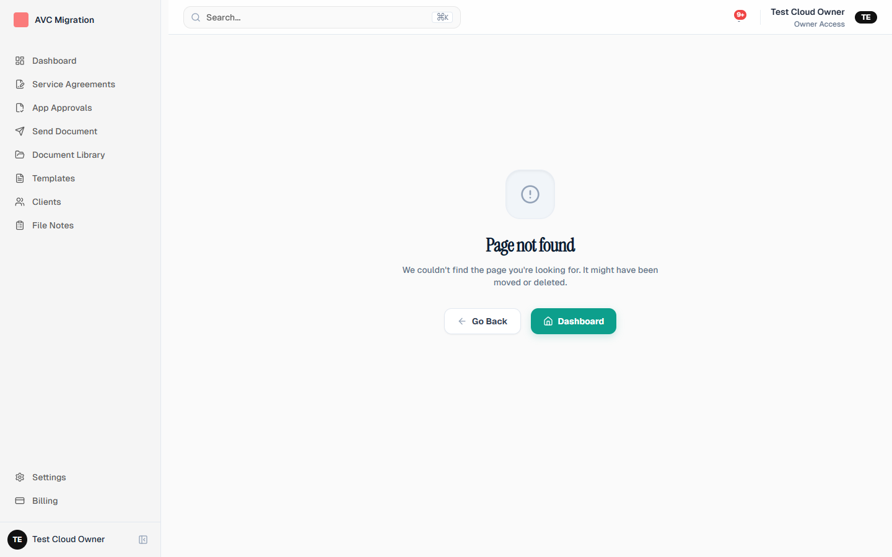
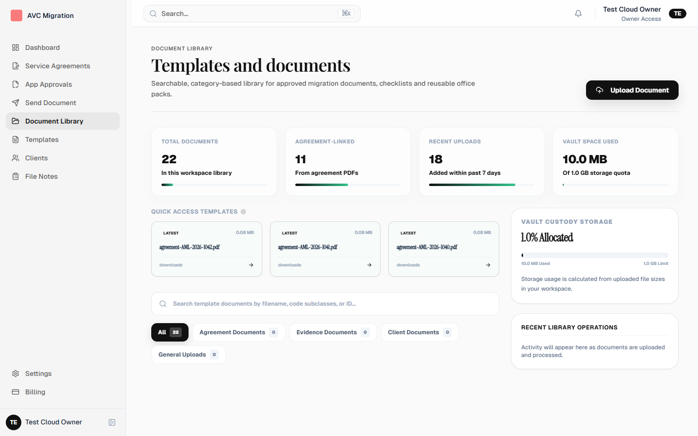
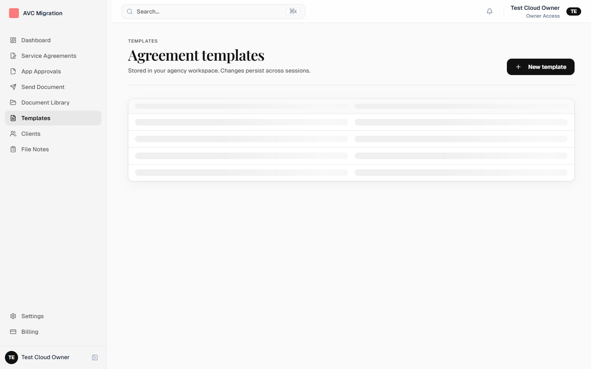
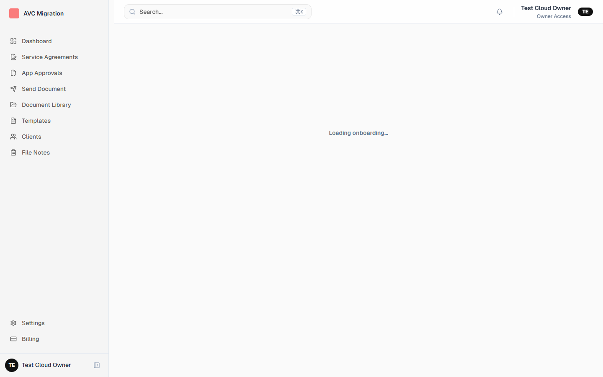
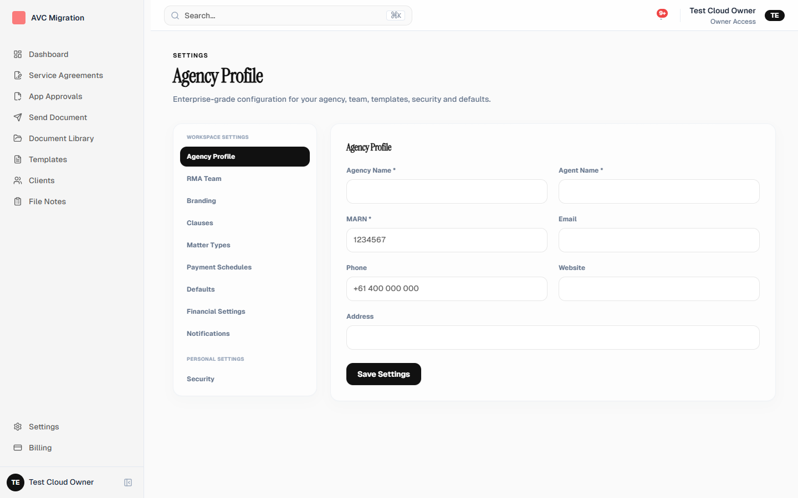

# DS-2.1 Visual Regression Audit

Generated: 2026-06-10T04:35:48.030Z
Server: http://localhost:3001
Agency: `ritiklabs`
Method: Browser screenshots only — not code inspection

## Screenshots

### Dashboard

### Clients

### File Notes

### Agreements

### Approvals

### Approvals New

### Documents

### Templates

### Onboarding

### Settings

## Browser findings

- **WARN** Agreements: Legacy teal #0D9F8C (1 DOM hits)
- **WARN** Approvals: Legacy teal #0D9F8C (1 DOM hits)
- **WARN** Approvals New: Legacy teal #0D9F8C (1 DOM hits)

## Unified visual language checklist

- PASS: Charcoal primary buttons (#111111)
- PASS: No emerald/teal Tailwind in DOM
- PASS: No full-page spinners
- PASS: Dashboard card filters use matter keys

## Overall: PASS (browser)

## Remaining carryover
| Area | Issue |
|------|-------|
| Agreement wizard steps | Legacy gradient/navy in PDF preview chrome |
| Auth marketing pages | Submit spinners acceptable |
| Stripe/billing internals | Plan ID strings unchanged |