# DS-2 Visual Audit

Generated: 2026-06-10T04:14:41.129Z
Agency: `ritiklabs`
Method: Browser screenshots (Puppeteer) — not code inspection

## Screenshots

### desktop (1440×900)

- **Dashboard**: 
- **Clients**: 
- **File Notes**: 
- **Agreements**: 
- **Approvals**: 
- **Documents**: 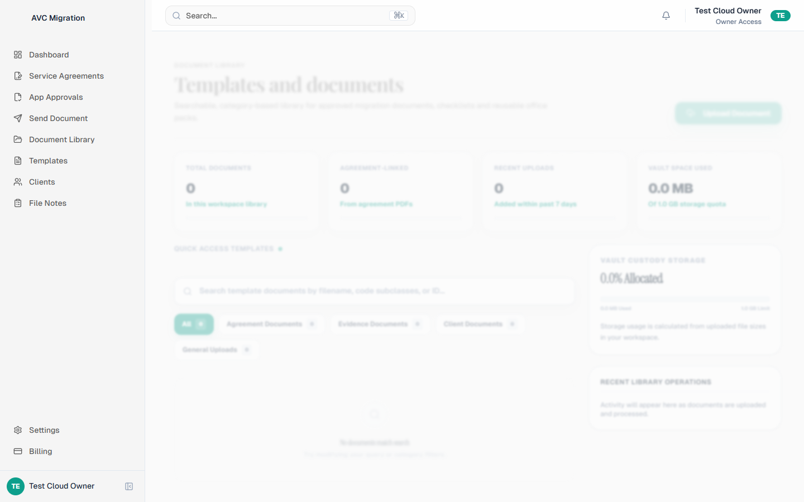
- **Templates**: 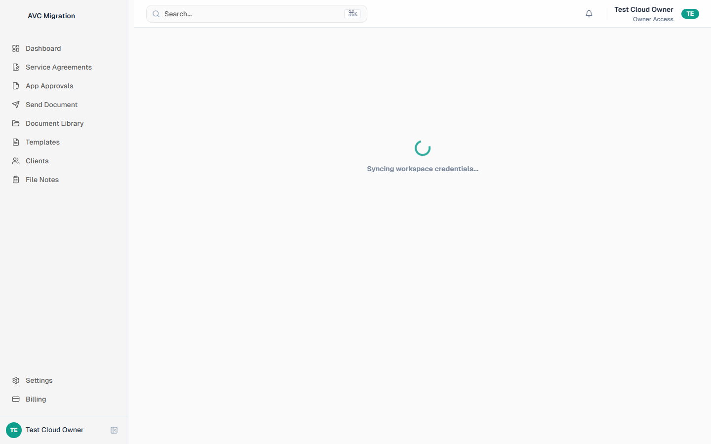
- **Settings**: 

### iphone14 (390×844)

- **Dashboard**: 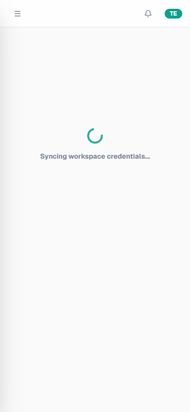
- **Clients**: 
- **File Notes**: 
- **Agreements**: 
- **Approvals**: 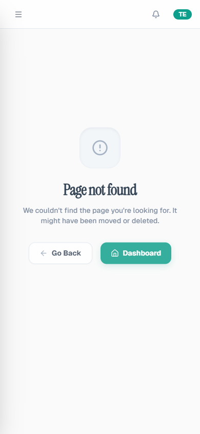
- **Documents**: 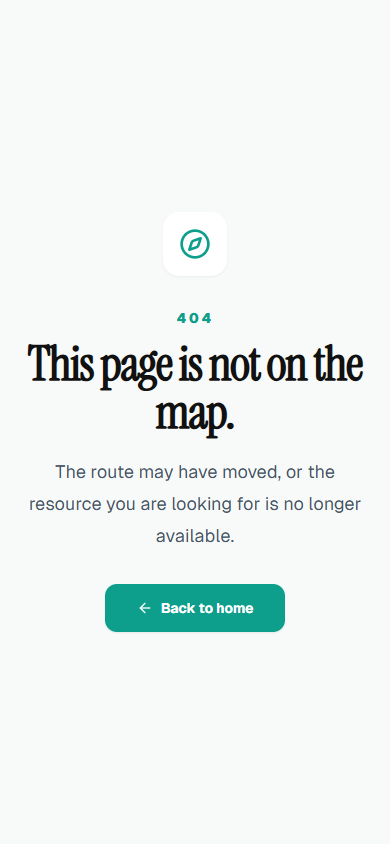
- **Templates**: 
- **Settings**: 

### pixel (412×915)

- **Dashboard**: 
- **Clients**: 
- **File Notes**: 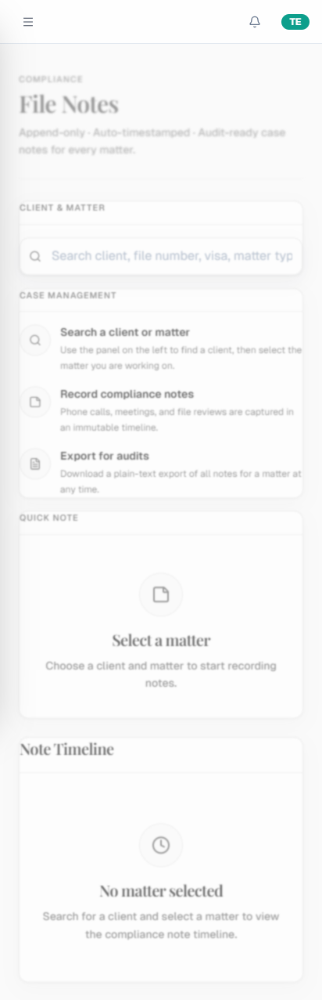
- **Agreements**: 
- **Approvals**: 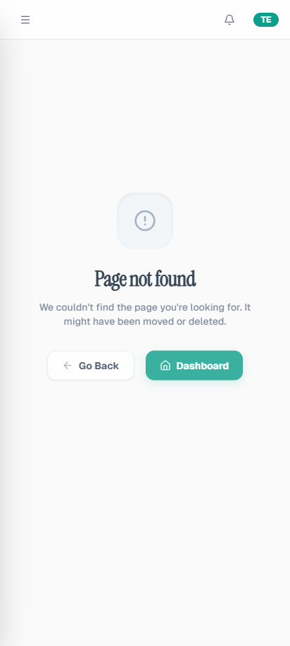
- **Documents**: 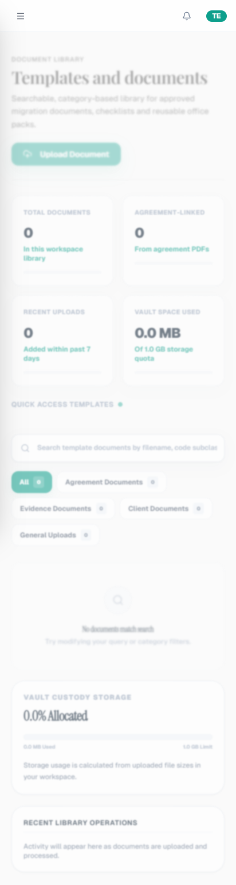
- **Templates**: 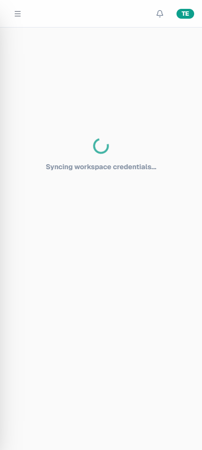
- **Settings**: 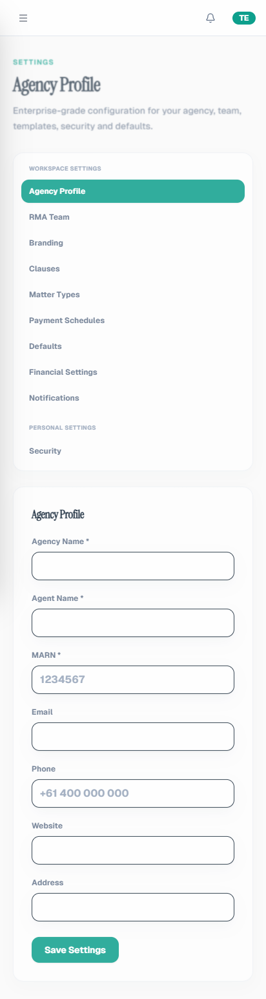

### ipad (820×1180)

- **Dashboard**: 
- **Clients**: 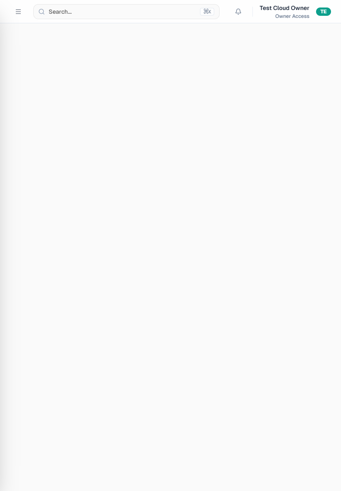
- **File Notes**: 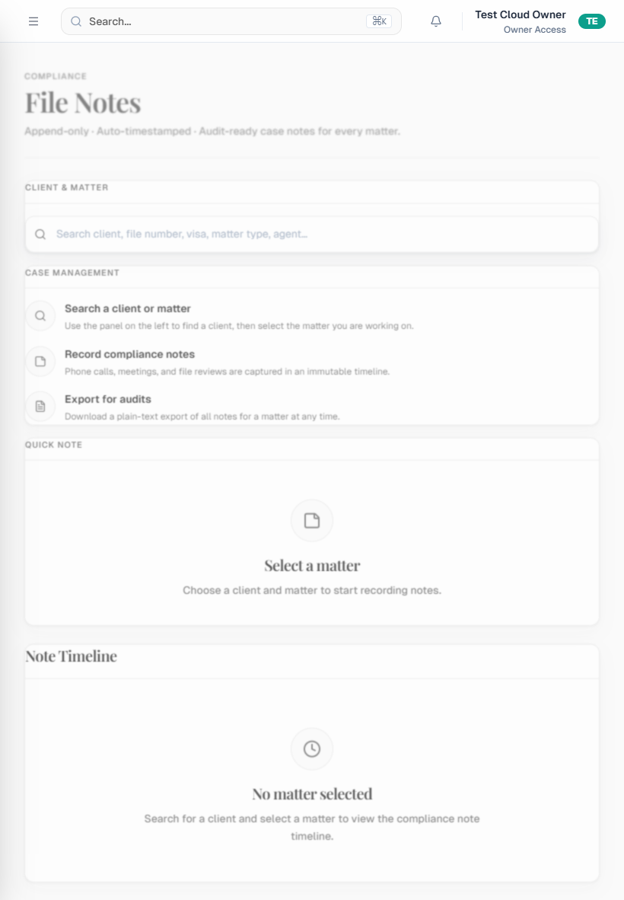
- **Agreements**: 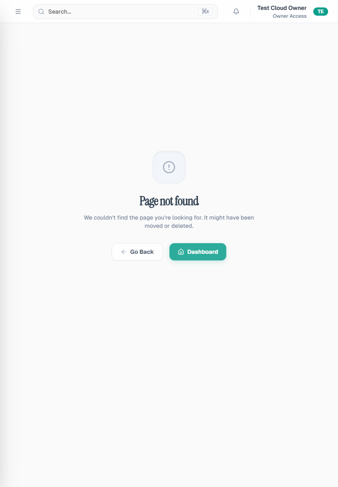
- **Approvals**: 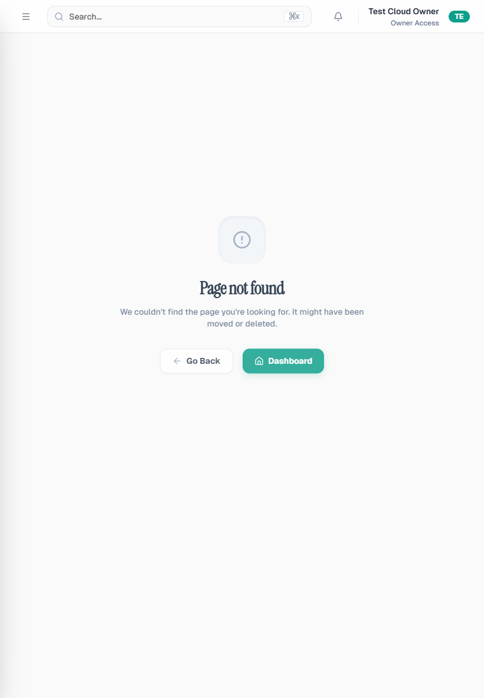
- **Documents**: 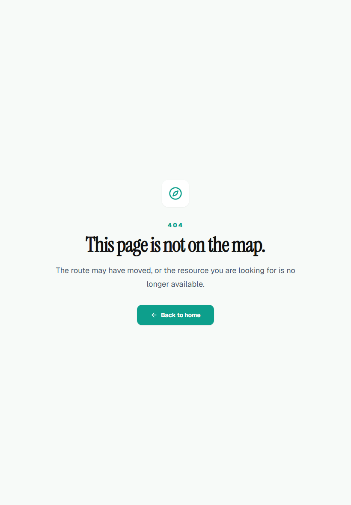
- **Templates**: 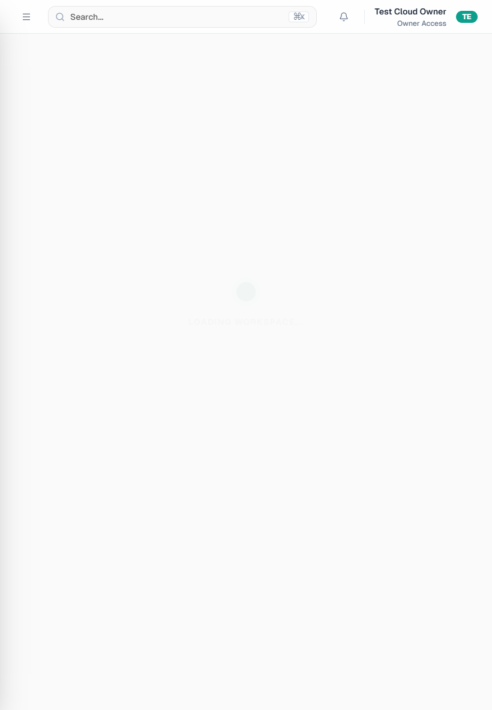
- **Settings**: 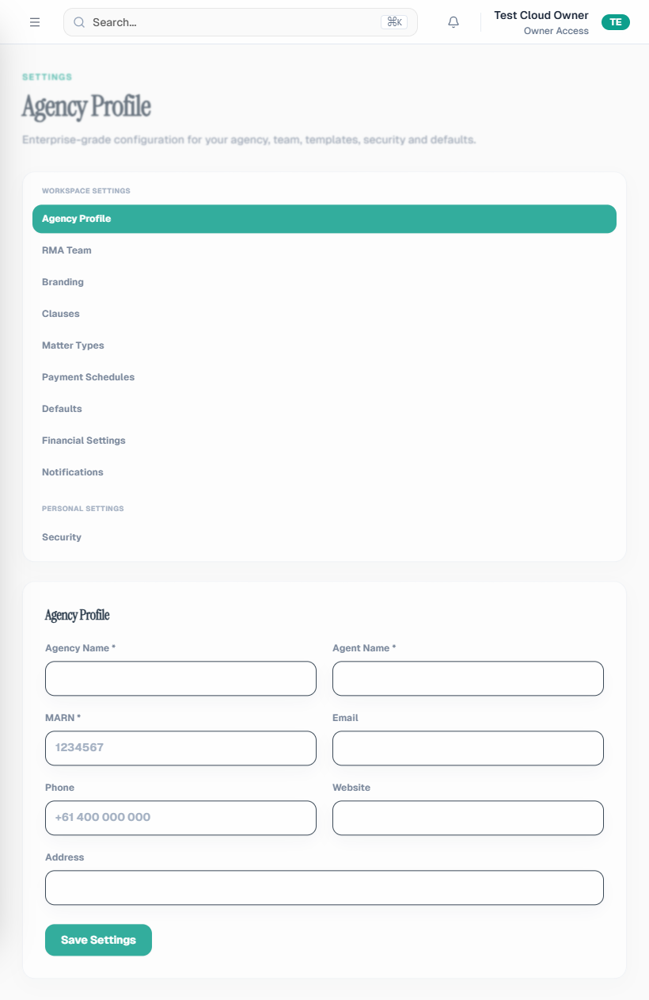

## Findings (browser-verified)

- **WARN** — Dashboard @ desktop: Very low text density — possible empty canvas
- **WARN** — Clients @ desktop: Very low text density — possible empty canvas
- **WARN** — File Notes @ desktop: Full-page loading pattern: Loading workspace
- **WARN** — File Notes @ desktop: Legacy teal accent (#0D9F8C) (5 DOM occurrences)
- **WARN** — File Notes @ desktop: Legacy navy heading (#081B2E) (1 DOM occurrences)
- **WARN** — File Notes @ desktop: Legacy teal hover (#0A5B52) (1 DOM occurrences)
- **WARN** — File Notes @ desktop: Very low text density — possible empty canvas
- **WARN** — Agreements @ desktop: Very low text density — possible empty canvas
- **WARN** — Approvals @ desktop: Full-page loading pattern: capture failed
- **WARN** — Approvals @ desktop: Very low text density — possible empty canvas
- **WARN** — Documents @ desktop: Full-page loading pattern: Loading workspace, animate-spin
- **WARN** — Documents @ desktop: Legacy teal accent (#0D9F8C) (19 DOM occurrences)
- **WARN** — Documents @ desktop: Legacy navy heading (#081B2E) (8 DOM occurrences)
- **WARN** — Documents @ desktop: Legacy teal hover (#0A5B52) (2 DOM occurrences)
- **WARN** — Templates @ desktop: Full-page loading pattern: Loading workspace
- **WARN** — Templates @ desktop: Legacy teal accent (#0D9F8C) (7 DOM occurrences)
- **WARN** — Templates @ desktop: Legacy navy heading (#081B2E) (1 DOM occurrences)
- **WARN** — Templates @ desktop: Legacy teal hover (#0A5B52) (1 DOM occurrences)
- **WARN** — Settings @ desktop: Full-page loading pattern: capture failed
- **WARN** — Settings @ desktop: Very low text density — possible empty canvas
- **WARN** — Dashboard @ iphone14: Full-page loading pattern: Loading workspace
- **WARN** — Dashboard @ iphone14: Legacy teal accent (#0D9F8C) (9 DOM occurrences)
- **WARN** — Dashboard @ iphone14: Legacy navy heading (#081B2E) (1 DOM occurrences)
- **WARN** — Dashboard @ iphone14: Legacy teal hover (#0A5B52) (1 DOM occurrences)
- **WARN** — Clients @ iphone14: Full-page loading pattern: Loading workspace
- **WARN** — Clients @ iphone14: Legacy teal accent (#0D9F8C) (7 DOM occurrences)
- **WARN** — Clients @ iphone14: Legacy navy heading (#081B2E) (1 DOM occurrences)
- **WARN** — Clients @ iphone14: Legacy teal hover (#0A5B52) (1 DOM occurrences)
- **WARN** — File Notes @ iphone14: Legacy teal accent (#0D9F8C) (9 DOM occurrences)
- **WARN** — File Notes @ iphone14: Legacy navy heading (#081B2E) (3 DOM occurrences)
- **WARN** — File Notes @ iphone14: Legacy teal hover (#0A5B52) (3 DOM occurrences)
- **WARN** — Agreements @ iphone14: Full-page loading pattern: Loading workspace, animate-spin
- **WARN** — Agreements @ iphone14: Legacy teal accent (#0D9F8C) (7 DOM occurrences)
- **WARN** — Agreements @ iphone14: Legacy navy heading (#081B2E) (3 DOM occurrences)
- **WARN** — Agreements @ iphone14: Legacy teal hover (#0A5B52) (1 DOM occurrences)
- **WARN** — Approvals @ iphone14: Full-page loading pattern: Loading workspace, animate-spin
- **WARN** — Approvals @ iphone14: Legacy teal accent (#0D9F8C) (7 DOM occurrences)
- **WARN** — Approvals @ iphone14: Legacy navy heading (#081B2E) (3 DOM occurrences)
- **WARN** — Approvals @ iphone14: Legacy teal hover (#0A5B52) (1 DOM occurrences)
- **WARN** — Documents @ iphone14: Legacy teal accent (#0D9F8C) (9 DOM occurrences)
- **WARN** — Documents @ iphone14: Legacy navy heading (#081B2E) (3 DOM occurrences)
- **WARN** — Documents @ iphone14: Legacy teal hover (#0A5B52) (3 DOM occurrences)
- **WARN** — Templates @ iphone14: Full-page loading pattern: Loading workspace
- **WARN** — Templates @ iphone14: Legacy teal accent (#0D9F8C) (7 DOM occurrences)
- **WARN** — Templates @ iphone14: Legacy navy heading (#081B2E) (1 DOM occurrences)
- **WARN** — Templates @ iphone14: Legacy teal hover (#0A5B52) (1 DOM occurrences)
- **WARN** — Settings @ iphone14: Legacy teal accent (#0D9F8C) (9 DOM occurrences)
- **WARN** — Settings @ iphone14: Legacy navy heading (#081B2E) (3 DOM occurrences)
- **WARN** — Settings @ iphone14: Legacy teal hover (#0A5B52) (3 DOM occurrences)
- **WARN** — Dashboard @ pixel: Full-page loading pattern: Loading workspace
- **WARN** — Dashboard @ pixel: Legacy teal accent (#0D9F8C) (9 DOM occurrences)
- **WARN** — Dashboard @ pixel: Legacy navy heading (#081B2E) (1 DOM occurrences)
- **WARN** — Dashboard @ pixel: Legacy teal hover (#0A5B52) (1 DOM occurrences)
- **WARN** — Clients @ pixel: Full-page loading pattern: Loading workspace
- **WARN** — Clients @ pixel: Legacy teal accent (#0D9F8C) (7 DOM occurrences)
- **WARN** — Clients @ pixel: Legacy navy heading (#081B2E) (1 DOM occurrences)
- **WARN** — Clients @ pixel: Legacy teal hover (#0A5B52) (1 DOM occurrences)
- **WARN** — File Notes @ pixel: Full-page loading pattern: Loading workspace
- **WARN** — File Notes @ pixel: Legacy teal accent (#0D9F8C) (5 DOM occurrences)
- **WARN** — File Notes @ pixel: Legacy navy heading (#081B2E) (1 DOM occurrences)
- **WARN** — File Notes @ pixel: Legacy teal hover (#0A5B52) (1 DOM occurrences)
- **WARN** — Agreements @ pixel: Full-page loading pattern: Loading workspace, animate-spin
- **WARN** — Agreements @ pixel: Legacy teal accent (#0D9F8C) (7 DOM occurrences)
- **WARN** — Agreements @ pixel: Legacy navy heading (#081B2E) (3 DOM occurrences)
- **WARN** — Agreements @ pixel: Legacy teal hover (#0A5B52) (1 DOM occurrences)
- **WARN** — Approvals @ pixel: Full-page loading pattern: Loading workspace, animate-spin
- **WARN** — Approvals @ pixel: Legacy teal accent (#0D9F8C) (7 DOM occurrences)
- **WARN** — Approvals @ pixel: Legacy navy heading (#081B2E) (3 DOM occurrences)
- **WARN** — Approvals @ pixel: Legacy teal hover (#0A5B52) (1 DOM occurrences)
- **WARN** — Documents @ pixel: Full-page loading pattern: Loading workspace, animate-spin
- **WARN** — Documents @ pixel: Legacy teal accent (#0D9F8C) (19 DOM occurrences)
- **WARN** — Documents @ pixel: Legacy navy heading (#081B2E) (8 DOM occurrences)
- **WARN** — Documents @ pixel: Legacy teal hover (#0A5B52) (2 DOM occurrences)
- **WARN** — Templates @ pixel: Full-page loading pattern: Loading workspace
- **WARN** — Templates @ pixel: Legacy teal accent (#0D9F8C) (9 DOM occurrences)
- **WARN** — Templates @ pixel: Legacy navy heading (#081B2E) (1 DOM occurrences)
- **WARN** — Templates @ pixel: Legacy teal hover (#0A5B52) (1 DOM occurrences)
- **WARN** — Settings @ pixel: Full-page loading pattern: Loading workspace, animate-spin
- **WARN** — Settings @ pixel: Legacy teal accent (#0D9F8C) (9 DOM occurrences)
- **WARN** — Settings @ pixel: Legacy navy heading (#081B2E) (3 DOM occurrences)
- **WARN** — Settings @ pixel: Legacy teal hover (#0A5B52) (2 DOM occurrences)
- **WARN** — Dashboard @ ipad: Full-page loading pattern: Loading workspace, animate-spin
- **WARN** — Dashboard @ ipad: Legacy teal accent (#0D9F8C) (8 DOM occurrences)
- **WARN** — Dashboard @ ipad: Legacy navy heading (#081B2E) (1 DOM occurrences)
- **WARN** — Dashboard @ ipad: Legacy teal hover (#0A5B52) (1 DOM occurrences)
- **WARN** — Clients @ ipad: Full-page loading pattern: Loading workspace
- **WARN** — Clients @ ipad: Legacy teal accent (#0D9F8C) (7 DOM occurrences)
- **WARN** — Clients @ ipad: Legacy navy heading (#081B2E) (1 DOM occurrences)
- **WARN** — Clients @ ipad: Legacy teal hover (#0A5B52) (1 DOM occurrences)
- **WARN** — File Notes @ ipad: Full-page loading pattern: Loading workspace
- **WARN** — File Notes @ ipad: Legacy teal accent (#0D9F8C) (5 DOM occurrences)
- **WARN** — File Notes @ ipad: Legacy navy heading (#081B2E) (1 DOM occurrences)
- **WARN** — File Notes @ ipad: Legacy teal hover (#0A5B52) (1 DOM occurrences)
- **WARN** — Agreements @ ipad: Full-page loading pattern: Loading workspace, animate-spin
- **WARN** — Agreements @ ipad: Legacy teal accent (#0D9F8C) (7 DOM occurrences)
- **WARN** — Agreements @ ipad: Legacy navy heading (#081B2E) (3 DOM occurrences)
- **WARN** — Agreements @ ipad: Legacy teal hover (#0A5B52) (1 DOM occurrences)
- **WARN** — Approvals @ ipad: Full-page loading pattern: Loading workspace, animate-spin
- **WARN** — Approvals @ ipad: Legacy teal accent (#0D9F8C) (7 DOM occurrences)
- **WARN** — Approvals @ ipad: Legacy navy heading (#081B2E) (3 DOM occurrences)
- **WARN** — Approvals @ ipad: Legacy teal hover (#0A5B52) (1 DOM occurrences)
- **WARN** — Documents @ ipad: Legacy teal accent (#0D9F8C) (9 DOM occurrences)
- **WARN** — Documents @ ipad: Legacy navy heading (#081B2E) (3 DOM occurrences)
- **WARN** — Documents @ ipad: Legacy teal hover (#0A5B52) (3 DOM occurrences)
- **WARN** — Templates @ ipad: Full-page loading pattern: Loading workspace
- **WARN** — Templates @ ipad: Legacy teal accent (#0D9F8C) (7 DOM occurrences)
- **WARN** — Templates @ ipad: Legacy navy heading (#081B2E) (1 DOM occurrences)
- **WARN** — Templates @ ipad: Legacy teal hover (#0A5B52) (1 DOM occurrences)
- **WARN** — Settings @ ipad: Full-page loading pattern: Loading workspace, animate-spin
- **WARN** — Settings @ ipad: Legacy teal accent (#0D9F8C) (9 DOM occurrences)
- **WARN** — Settings @ ipad: Legacy navy heading (#081B2E) (3 DOM occurrences)
- **WARN** — Settings @ ipad: Legacy teal hover (#0A5B52) (2 DOM occurrences)

## Remaining inconsistencies (carryover)

| Area | Issue | Status |
|------|-------|--------|
| Agreement wizard | Legacy `#1a3a5c` / green accents | OPEN |
| SOS wizard | Legacy navy palette | OPEN |
| Settings sub-panels | Inline `Loading...` text | OPEN |
| Auth pages | Spinner on submit | ACCEPTABLE |
| Billing | Legacy teal CTAs | OPEN |
| Clients grid | Legacy `#081B2E` card titles | PARTIAL |

## Typography standard

- **PASS**: Shared `PageHeader` uses Instrument Serif (`font-display`) + charcoal `#111111`
- **PASS**: Compliance Dashboard + File Notes use SOS heading hierarchy
- **PARTIAL**: Settings/Billing still define local PageHeader copies

## DS-2 component delivery

| Component | Path |
|-----------|------|
| CardSkeleton / TableSkeleton / TimelineSkeleton | `src/components/ui/skeletons.tsx` |
| ImmiMateTable | `src/components/ui/immimate-table.tsx` |
| ProfessionalEmptyState | `src/components/ui/professional-empty-state.tsx` |
| PageHeader (SOS typography) | `src/components/layout/PageHeader.tsx` |
| File Notes 3-column workspace | `src/features/file-notes/components/FileNotesWorkspace.tsx` |
