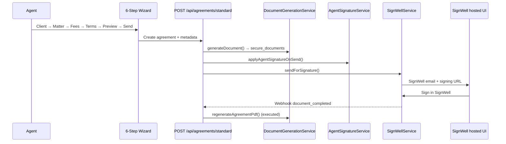
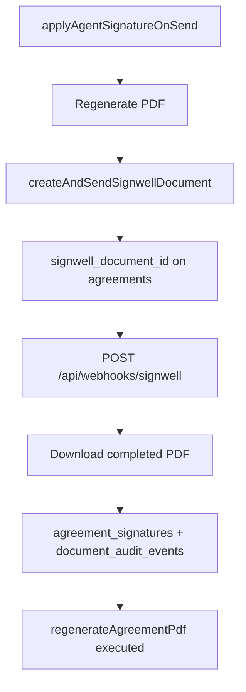
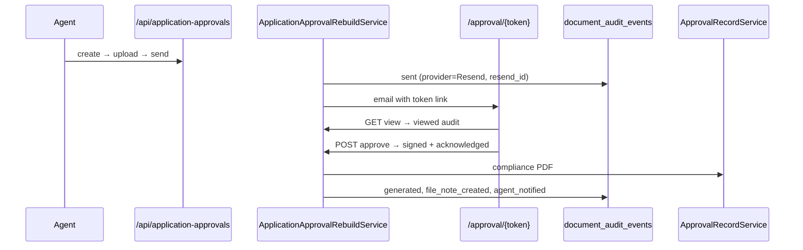

# Native Agreement Signing V1 — Architecture

**Project:** ImmiSign (ImmiMate)  
**Date:** 2026-06-23  
**Status:** Phase 1 — Discovery complete  
**Constraint:** SignWell remains available; native signing is additive behind `SIGNING_PROVIDER`.

---

## 1. Executive summary

Native agreement signing replaces SignWell **only for service agreements** when `SIGNING_PROVIDER=native`. The design mirrors the **Application Approval rebuild** (token portal, `document_audit_events`, compliance PDF, system file notes, Resend emails with forensic audit) rather than inventing parallel systems.

SignWell code paths (`SignWellService`, webhooks, `signwell_document_id`) are **unchanged** and selected when `SIGNING_PROVIDER=signwell`.

---

## 2. Current agreement flow



### Key files

| Area | Path |
|------|------|
| Wizard UI | `src/features/agreements/components/wizard/` |
| Send API | `src/app/api/agreements/standard/route.ts` |
| Resend send | `src/app/api/agreements/send/route.ts` |
| PDF HTML | `src/features/agreements/lib/agreement-preview-html.ts` |
| PDF engine | `src/features/agreements/services/pdf.service.ts` |
| Generation | `src/features/agreements/services/document-generation.service.ts` |
| State machine | `src/features/agreements/services/state-machine.ts` |
| Agent sig | `src/features/agreements/services/agent-signature.service.ts` |

### Current status lifecycle (DB enum)

```
draft → pending → sent → viewed → signed → completed
         (generated)     ↘ declined / expired / cancelled / rejected
```

**Gaps today:** Agent signature image not rendered in HTML (metadata only); client block shows dashed “Sign here” placeholder; no native portal; SignWell quota blocks production E2E.

---

## 3. Current SignWell flow



| Component | Path |
|-----------|------|
| SignWell client | `src/lib/signwell/client.ts` |
| Dispatch | `src/lib/signwell/document-dispatch.ts` |
| Field placement | `src/lib/signwell/signature-fields.ts` — last page, x=72, y=620, 220×40 |
| Service | `src/features/agreements/services/signwell.service.ts` |
| Webhook | `src/app/api/webhooks/signwell/route.ts` |

**Env:** `SIGNWELL_API_KEY`, `SIGNWELL_WEBHOOK_ID`, optional `SIGNWELL_TEST_MODE`.  
**DB:** `signwell_document_id`, `signwell_status`, `signature_provider='signwell'` (on webhook).

**Preservation rule:** All SignWell modules remain; routing switches at dispatch time only.

---

## 4. Current Application Approval flow (reuse blueprint)



### Reusable patterns (do not duplicate)

| Pattern | Approval implementation | Agreement native reuse |
|---------|---------------------------|------------------------|
| Audit wrapper | `application-approval-audit.ts` | `agreement-signing-audit.ts` |
| Audit core | `DocumentAuditService` | Same — `document_type: 'service_agreement'` |
| Compliance PDF | `ApprovalRecordService` | `AgreementSigningRecordService` |
| File note | `recordClientSystemNote()` | Same — `file_source: 'agreement'` |
| Email + resend_id | `sendEmailWithForensicLogging()` | Same templates pattern |
| Public portal | `/approval/[token]` + rate limit | `/agreement/sign/[token]` |
| Token TTL | 90 days | Same default |
| Lock after terminal | `ConflictError` on re-submit | Same for `signed`/`completed` |
| Enrichment API | `enrichApplicationApprovalAuditEvents()` | `enrichAgreementSigningAuditEvents()` |

---

## 5. Reusable services

| Service | Reuse |
|---------|-------|
| `DocumentAuditService` | Append-only audit rows |
| `PDFService.generatePdf()` | Agreement PDF, signed PDF, compliance record |
| `sendEmailWithForensicLogging()` | Client + agent emails |
| `recordEmailDelivery()` | `email_delivery_audit` |
| `FileNotesService.recordClientSystemNote()` | Post-sign system note |
| `NotificationService` | In-app agent alert |
| `AgentSignatureService` | Agent sig at generate/send (extend for HTML embed) |
| `loadRmaSignatureForUser()` | Resolve PNG for agent block |
| `AgreementStateMachine` | Extend guards for native lifecycle |
| `createAdminClient()` | Public token routes |

---

## 6. Reusable tables

| Table | Use for native signing |
|-------|------------------------|
| `agreements` | Extend columns (see §7) |
| `documents` | Registry rows for PDFs |
| `document_audit_events` | All compliance events (`document_type='service_agreement'`) |
| `file_notes` | System note on sign |
| `email_delivery_audit` | Resend trail |
| `activity_logs` | Agent activity |
| `user_signatures` | Agent PNG (existing) |
| `rmas` | MARN + optional RMA signature |
| `signers` | Client identity reference |
| `processed_webhooks` | N/A for native (SignWell only) |

**Not reused for native:** `agreement_signatures` (SignWell webhook writes) — native writes to `agreements.client_signature_storage_path` + audit instead.

---

## 7. New schema (migration `20260623100000_native_agreement_signing.sql`)

### 7.1 `agreements` — new columns

```sql
signing_provider          text CHECK (signing_provider IN ('native','signwell'))
signing_token             text UNIQUE          -- portal access (like approval_token)
token_expires_at          timestamptz

signed_pdf_storage_path   text                 -- final executed PDF
signing_record_storage_path text               -- compliance record PDF
client_signature_storage_path text             -- client PNG

viewed_at                 timestamptz          -- may exist; ensure present
downloaded_at             timestamptz

client_ip                 text
client_user_agent         text
client_name_confirmed     text

pdf_hash                  text                 -- SHA-256 of pre-sign PDF
signature_hash            text                 -- SHA-256 of client signature PNG
audit_hash                text                 -- SHA-256 of audit event chain snapshot

-- sent_at, signed_at, completed_at largely exist from prior migrations
```

**Note:** `signature_provider` column already exists (set to `signwell` by webhook). Native flow sets `signature_provider='native'`.

### 7.2 `users` — agent signature convenience (denormalized)

```sql
signature_storage_path    text                 -- points to default PNG in storage
signature_uploaded_at     timestamptz
```

**Source of truth remains** `user_signatures.storage_path` (`is_default=true`). On upload/replace/delete, sync `users.signature_storage_path`.

Existing bucket: `signatures/{agency_id}/{user_id}/{uuid}.png` (tenant-scoped RLS). User spec path `documents/signatures/{userId}/signature.png` is **not adopted** — would break tenant isolation; use existing bucket.

### 7.3 Status lifecycle (native)

```
draft → generated (pending) → sent → viewed → signed → completed
```

| Transition | Rule |
|------------|------|
| `completed → draft` | **FORBIDDEN** (DB trigger + API) |
| `signed → *edit*` | **FORBIDDEN** — all PATCH/regenerate/upload rejected |
| `sent+` | Wizard fields locked |

State machine update in `state-machine.ts`; DB trigger optional backstop on `agreements.status`.

### 7.4 Audit events (`document_audit_events`)

| Event type | When | Provider |
|------------|------|----------|
| `generated` | PDF created | `ImmiSign` |
| `sent` | Email dispatched | `Resend` |
| `viewed` | Portal opened | `ImmiSign Native Signing Portal` |
| `completed` | Download (`metadata.action=agreement_downloaded`) | Portal |
| `signed` | Client submits signature | Portal |
| `acknowledged` | Declarations accepted | Portal |
| `generated` | Signing record PDF (`action=agreement_record_generated`) | `ImmiSign` |
| `completed` | File note (`action=file_note_created`) | Portal |
| `completed` | Agent notified (`action=agent_notified`) | `Resend` |
| `completed` | Client notified (`action=client_notified`) | `Resend` |

Events are **append-only** (existing RLS: INSERT + SELECT only).

---

## 8. Provider architecture

### 8.1 Configuration

```env
# Default in .env.example
SIGNING_PROVIDER=native

# Fallback
SIGNING_PROVIDER=signwell
```

**Resolution:** `src/lib/signing/config.ts` → `getSigningProvider(): 'native' | 'signwell'`

Per-agreement override: `agreements.signing_provider` set at send time from env (allows future per-tenant config).

### 8.2 Interface

```typescript
interface AgreementSigningProvider {
  sendForSignature(ctx: SendContext): Promise<SendResult>;
  cancel?(agreementId: string): Promise<void>;
}
```

| Implementation | File |
|----------------|------|
| `NativeAgreementSigningProvider` | `src/features/agreements/services/native-signing.provider.ts` |
| `SignWellAgreementSigningProvider` | wraps existing `SignWellService` |
| Factory | `src/lib/signing/provider-factory.ts` |

### 8.3 Dispatch integration

`POST /api/agreements/standard` and `POST /api/agreements/send`:

```typescript
const provider = createSigningProvider(getSigningProvider());
await provider.sendForSignature({ agencyId, userId, agreementId, ... });
```

SignWell branch: existing code path untouched inside adapter.

---

## 9. Native client signing portal

**Route:** `/agreement/sign/[token]`  
**API:** `/api/public/agreement-sign/[token]` (GET view, POST sign)  
**Download:** `/api/public/agreement-sign/[token]/download`

### Client workflow

1. View agreement (embedded PDF or link) → `viewed_at` + audit `viewed`
2. Download PDF → `downloaded_at` + audit `completed`/`agreement_downloaded`
3. Accept 4 declarations (all required)
4. Type full legal name — normalized match vs `clientFirstName` + `clientMiddleName` + `clientLastName`
5. Draw signature (`react-signature-canvas`) → PNG transparent background
6. Submit → stamp PDF, store artifacts, emails, file note, `signed` → `completed`

### Security

- Token: `crypto.randomUUID()`, unique index, 90-day expiry
- Rate limit: same as approval portal (60 GET / 20 POST / 30 download per IP)
- Admin client for lookup (no session)
- Single completion — `ConflictError` if already `signed`/`completed`
- IP + User-Agent captured on sign

---

## 10. PDF generation changes

### 10.1 Agent block (static at generate)

Remove manual sign box. Inject at PDF generation:

```
[Agent signature PNG — max-height 48px]

Rajwant Singh
MARN 1234567
AVC Visa

Date: 21/06/2026
```

**Implementation:** `buildAgreementPreviewHtml()` — use `AgentSignaturePreview.imageHtml` from `resolveAgentSignaturePreview()`.

### 10.2 Client block (pre-sign)

Remove:

- `<div class="sig-box">Sign here</div>`
- Dashed rectangle placeholder

Render only:

```
Client Signature
{name}
Date: ___________
```

Plus invisible anchor comment for stamping: `<!-- NATIVE_SIG_ANCHOR page=N x=72 y=620 w=220 h=40 -->`

### 10.3 Client signature stamp coordinates

Derived from SignWell field alignment (A4, 792pt height, top-left origin in SignWell):

| Field | Page | X | Y | Width | Height |
|-------|------|---|---|-------|--------|
| Client signature | Last | 72 | 620 | 220 | 40 |
| Client date | Last | 310 | 624 | 130 | 32 |

**pdf-lib stamping:** Convert Y from top-origin (792 - y - height) for bottom-left PDF coordinates. Verify visually after first native sign — adjust ±5pt if HTML layout drift.

**Post-sign HTML path:** Regenerate full HTML with `clientSigned: true` + embedded signature image (mirrors webhook `regenerateAgreementPdf`).

---

## 11. Compliance record PDF

**Service:** `AgreementSigningRecordService` (clone of `ApprovalRecordService`)

**Storage:** `{agencyId}/agreements/{agreementId}/agreement-signing-record.pdf`  
**Bucket:** `documents` (private)

**Contents:**

- Agreement ID, title, agency, agent, client
- Signed / viewed / downloaded timestamps
- IP, User-Agent, provider (`native`)
- Declarations accepted (list)
- `pdf_hash`, `signature_hash`, `audit_hash`
- Confirmed client name

---

## 12. Storage layout

| Artifact | Bucket | Path |
|----------|--------|------|
| Draft/generated PDF | `secure_documents` | `{agencyId}/agreements/{agreementId}/agreement-{ref}.pdf` |
| Signed PDF | `secure_documents` | `{agencyId}/agreements/{agreementId}/signed-agreement.pdf` |
| Signing record | `documents` | `{agencyId}/agreements/{agreementId}/agreement-signing-record.pdf` |
| Client signature PNG | `secure_documents` | `{agencyId}/agreements/{agreementId}/client-signature.png` |
| Agent signature PNG | `signatures` | `{agencyId}/{userId}/{uuid}.png` (existing) |

All paths prefixed with `agency_id` for isolation.

---

## 13. Emails

| Recipient | Template | Attachments | Audit |
|-----------|----------|-------------|-------|
| Client | Agreement Successfully Signed | `signed-agreement.pdf` | `resend_id`, `client_notified` |
| Agent | Agreement Signed By Client | `signed-agreement.pdf`, `agreement-signing-record.pdf` | `resend_id`, `agent_notified` |

Use `sendEmailWithForensicLogging()` + `recordApplicationApprovalAudit`-equivalent metadata on `document_audit_events`.

---

## 14. Agent signature management (Settings)

**Location:** Settings → My Profile (`?section=Profile`) — add sidebar link.

**Existing:** Upload/draw/type via `/api/signatures` → `user_signatures`.

**Enhancements:**

- PNG-only for upload (reject JPEG/WebP)
- Max 2 MB
- Transparent background warning (not blocking)
- Replace: delete old storage object, insert new row, sync `users.signature_storage_path`
- Remove: clear default + null `users.signature_storage_path`
- Activity log entry on change

**No new bucket** — extend `signatures` bucket policies (already tenant-scoped).

---

## 15. Security & locking

After `status IN ('signed','completed')`:

| Action | Result |
|--------|--------|
| PATCH agreement | 409 |
| Regenerate PDF | 409 |
| Edit fees/clauses/matter | 409 |
| Wizard draft resume | Read-only view |

**Hashes:**

- `pdf_hash`: SHA-256 of unsigned PDF at send
- `signature_hash`: SHA-256 of client PNG
- `audit_hash`: SHA-256 of canonical JSON of audit events for agreement

Verification endpoint (optional v1.1): `GET /api/agreements/[id]/integrity`

---

## 16. RLS verification plan

| Resource | Policy | Verification |
|----------|--------|--------------|
| `agreements` | `agency_id = get_tenant()` | Cross-agency SELECT returns 0 rows |
| `document_audit_events` | agency scoped | Cannot read other agency events |
| `storage.signatures` | folder[1]=agency_id | Upload to wrong folder fails |
| `storage.secure_documents` | auth-only (gap) | App enforces `{agencyId}/...` prefix; document v1.1: tenant storage RLS |
| Public token routes | Service role + token match | Invalid token → 404 |

Document cross-agency test in E2E script.

---

## 17. Migration plan

| Step | Action |
|------|--------|
| 1 | Apply `20260623100000_native_agreement_signing.sql` |
| 2 | Deploy app with `SIGNING_PROVIDER=native` default |
| 3 | Existing SignWell agreements unchanged (`signing_provider='signwell'`) |
| 4 | New sends use native unless env overrides |
| 5 | Optional backfill: set `signing_provider='signwell'` where `signwell_document_id IS NOT NULL` |

**Zero downtime:** All columns nullable or defaulted; no enum breaking changes.

---

## 18. Rollback plan

| Scenario | Action |
|----------|--------|
| Native bugs in production | Set `SIGNING_PROVIDER=signwell` in Vercel env → redeploy (instant) |
| Partial native sign failure | Agreement stays `sent`; agent can retry send or cancel |
| Bad migration | Columns are additive; rollback migration drops new columns only if no native data |
| Data integrity | SignWell agreements unaffected; native rows identified by `signing_provider='native'` |

**Never delete** SignWell code paths during rollback.

---

## 19. Implementation phases map

| Phase | Deliverable |
|-------|-------------|
| 1 | This document |
| 2 | SQL migration |
| 3 | Profile signature PNG validation + sidebar link |
| 4 | PDF HTML — agent embed, client placeholder removal |
| 5 | Portal UI + public API |
| 6 | PDF stamping (`pdf-lib` or regenerate HTML) |
| 7 | `AgreementSigningRecordService` |
| 8 | Storage writes + documents rows |
| 9 | File note auto-create |
| 10 | Emails + audit |
| 11 | API locks + hash storage |
| 12 | RLS verification doc + tests |
| 13 | `scripts/native-agreement-signing-e2e.mjs` |
| 14 | Build, lint, deploy, production E2E |

---

## 20. Success criteria (no PASS from code inspection)

PASS only when production E2E confirms:

- [ ] Browser: agent signature upload/replace/delete
- [ ] Browser: full wizard + native send
- [ ] Browser: client portal sign
- [ ] DB: all audit events + hashes
- [ ] Storage: all three artifacts exist, size > 0
- [ ] Email: resend_id in audit
- [ ] Visual: signature inside client signature area on signed PDF
- [ ] Visual: compliance record PDF complete
- [ ] File note present

Deliverable: `docs/NATIVE_AGREEMENT_SIGNING_DELIVERABLES.md`

---

## 21. Open decisions

1. **Multi-signer agreements** (secondary applicant, sponsor): v1 signs primary client only; additional signers deferred to v2.
2. **Storage RLS hardening** for `secure_documents`: recommended follow-up migration.
3. **`users.signature_storage_path` vs `user_signatures` only:** denormalized column for fast agent PDF lookup; synced on upload.

---

**Next step:** Phase 2 — apply migration `20260623100000_native_agreement_signing.sql`, then implement provider factory and native signing service.
