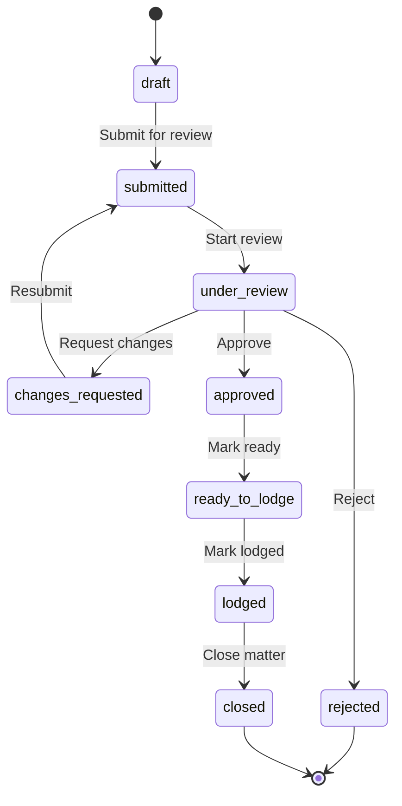
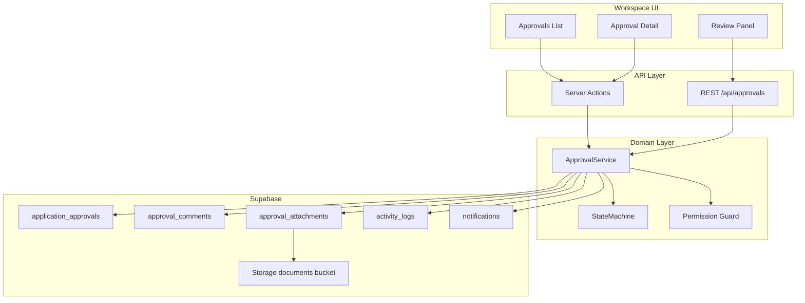

# Phase 12 — Application Approval Module: Schema Audit & Implementation Plan

**Date:** 2026-06-03  
**Status:** Planning only — **awaiting approval before implementation**  
**Stripe E2E:** Deferred (client credentials not provided)  
**Billing architecture:** Out of scope — no Phase 12 changes to `src/app/api/stripe/*`, subscriptions, or seat logic

---

## Executive summary

Phase 11 confirmed a **partial** Application Approvals foundation: `application_approvals` and `approval_comments` exist, RLS was added in Phase 11.1, and `src/features/approvals/` provides service/repository/actions. The current product model is **client document review** (`pending_review`, `viewed`, token portal), not the **internal migration-agency workflow** specified for Phase 12 (`submitted` → `under_review` → `ready_to_lodge` → `lodged` → `closed`).

Phase 12 will **extend** the existing schema and feature layer—not rebuild a second approval system. The legacy `public.approvals` table and duplicate UI routes will be **deprecated**, not duplicated.

---

## Pre-flight gate (Phase 12 start criteria)

| Check | Result | Notes |
|-------|--------|-------|
| Open P0 defects (Phase 11 audit) | **CLEAR** | Settings role mapping fixed (11.1); `application_approvals` / `approval_comments` RLS added (11.1 / 11.2 repair) |
| `node scripts/phase11-2-migration-verify.mjs` | **PASS** (exit 0) | All 22 migrations applied; approval tables probed |
| Phase 11 billing preserved | **YES** | No Phase 12 work touches billing routes, `subscriptions`, or Stripe webhooks |
| Stripe production E2E | **DEFERRED** | External dependency — documented in Phase 11.4; not a Phase 12 blocker |
| Agreement Wizard / Settings / Permissions / Send Document compile | **PASS (dev)** | `next build` compiles application code successfully; static export fails on `/404`, `/500`, and some marketing prerender (pre-existing; not approval-specific) |
| Phase 12 coding started | **NO** | This document only |

**Remaining non-P0 items (unchanged):** Send Document browser E2E flake, SignWell trial quota, Stripe key alignment. These do not block Phase 12 planning or internal-approval implementation.

---

## Part 1 — Data model audit

### 1.1 `application_approvals` (canonical table)

**Source:** `supabase/migrations/20260529000002_application_approvals.sql`  
**RLS:** `20260603170000_phase11_1_hardening.sql` (repaired in `20260603180000_phase11_2_schema_repair.sql`)

| Column | Type | Used today | Phase 12 requirement | Gap |
|--------|------|------------|----------------------|-----|
| `id` | UUID PK | Yes | Yes | — |
| `agency_id` | UUID FK | Yes | Yes | — |
| `client_id` | UUID FK nullable | Yes | Yes (Client) | — |
| `created_by` | UUID FK | Yes | Responsible Agent (creator) | Rename semantically in UI only |
| `title` | VARCHAR(255) | Yes | Display title / matter label | Consider split from `approval_number` |
| `visa_subclass` | VARCHAR(255) | Yes | Visa Subclass | — |
| `status` | VARCHAR(50) | Yes | 10-state lifecycle | **Enum drift** — see §2 |
| `review_token` | VARCHAR UNIQUE | Yes | Optional client portal only | Phase 12 is internal-first; keep for future client visibility |
| `document_path` | TEXT | Yes | Legacy single file | Supersede with `approval_attachments` |
| `version_number` | INT | Yes | Attachment versioning | Move to attachment rows |
| `revision_count` | INT | Yes | Resubmission counter | Keep |
| `lodgement_deadline` | TIMESTAMPTZ | Yes | Due Date | Rename in API/UI as `due_date` alias |
| `approved_at` | TIMESTAMPTZ | Partial | Final approval timestamp | Clarify vs `ready_to_lodge_at`, `lodged_at` |
| `created_at` / `updated_at` | TIMESTAMPTZ | Yes | Yes | — |
| `deleted_at` | TIMESTAMPTZ | Yes (RLS filter) | Soft delete | — |
| — | — | — | `approval_number` (APP-2026-0001) | **Missing** |
| — | — | — | `matter_id` or matter reference | **Missing** — no `matters` table; use `matter_type_id` FK |
| — | — | — | `assigned_reviewer_id` | **Missing** |
| — | — | — | `assigned_rma_id` | **Missing** |
| — | — | — | `matter_type_id` | **Missing** (use `matter_types`) |
| — | — | — | `priority` | **Missing** |
| — | — | — | `notes` / `internal_notes` | **Missing** |
| — | — | — | `submitted_at`, `lodged_at`, `closed_at` | **Missing** (timeline helpers) |

**Indexes to add (planned migration `20260604*_phase12_application_approvals.sql`):**

- `(agency_id, approval_number)` UNIQUE  
- `(agency_id, status)`  
- `(agency_id, assigned_reviewer_id)` WHERE NOT NULL  
- `(agency_id, created_by)`  
- `(agency_id, due_date)` or `lodgement_deadline`

**Approval number generation:** Postgres sequence or `approval_number_counters(agency_id, year)` table + function `next_approval_number(agency_id)` → `APP-2026-0001` format.

---

### 1.2 `approval_comments`

| Column | Type | Used today | Phase 12 requirement | Gap |
|--------|------|------------|----------------------|-----|
| `id` | UUID PK | Yes | Yes | — |
| `approval_id` | UUID FK | Yes | Yes | — |
| `author_type` | VARCHAR | `agent` / `client` | Staff roles + optional client | Extend to `author_role` (UI role snapshot) |
| `author_id` | UUID nullable | Partial | Author user | Required for staff comments |
| `content` | TEXT | Yes | Body | — |
| `created_at` | TIMESTAMPTZ | Yes | Timestamp | — |
| — | — | — | `parent_id` (threading) | **Missing** |
| — | — | — | `visibility` (`internal` / `client_visible`) | **Missing** |
| — | — | — | `mentions` (JSONB user ids) | **Missing** |
| — | — | — | `updated_at`, `deleted_at` | **Missing** (soft edit optional P2) |

**RLS gap:** No `UPDATE` policy; insert restricted to `author_type = 'agent'` and roles `owner, admin, manager, agent` — Case Manager maps to `manager` in DB but UI says "Case Manager". Comments from `viewer`/`reviewer` blocked (correct for read-only).

---

### 1.3 `approval_attachments` (new table)

Does not exist. Required for Part 7.

```sql
-- Planned shape (final migration will match ImmiSign conventions)
approval_attachments (
  id UUID PK,
  agency_id UUID NOT NULL,
  approval_id UUID NOT NULL REFERENCES application_approvals,
  uploaded_by UUID NOT NULL REFERENCES users,
  file_name TEXT NOT NULL,
  storage_path TEXT NOT NULL,
  mime_type TEXT,
  file_size BIGINT,
  version_number INT NOT NULL DEFAULT 1,
  is_current BOOLEAN DEFAULT true,
  created_at TIMESTAMPTZ DEFAULT now()
)
```

Storage path pattern already defined: `{agencyId}/approvals/{approvalId}/{fileName}` in `src/lib/supabase/storage.ts`.

Bucket: reuse `documents` with tenant RLS on path prefix (same as agreements).

---

### 1.4 Related tables

| Table | Role in Phase 12 | Notes |
|-------|-------------------|-------|
| `clients` | Client link | `application_approvals.client_id`; list joins via `ApprovalsRepository` |
| `users` | Agents, reviewers, RMAs | `assigned_reviewer_id`, `assigned_rma_id`, `created_by`; role from `users.role` enum |
| `matter_types` | Matter Type | FK `matter_type_id`; no standalone `matters` table in schema |
| `documents` | Not primary for approvals | Standalone send-doc flow; do not conflate with approval attachments |
| `activity_logs` | **Timeline (canonical)** | `type`, `title`, `description`, `reference_id`, `reference_type='application_approval'` |
| `audit_logs` | Secondary | Used by `AuditRepository` in agreements; approval service writes here today — **migrate approval events to `activity_logs` only** per spec |
| `notifications` | In-app alerts | Enum `notification_type`: extend with `'approval'` value (migration) |
| `public.approvals` | **Legacy duplicate** | Simple title/status; RLS exists; **no app code should write here post–Phase 12** |

---

### 1.5 `activity_logs` vs `audit_logs` (decision)

| System | Table | Phase 12 usage |
|--------|-------|----------------|
| Dashboard recent activity | `activity_logs` | **Primary** — matches agreements send + webhooks |
| Agreement audit trail | `audit_logs` | Do not use for approvals |
| Current `ApprovalService` | `audit_logs` via `AuditRepository` | **Replace** with `ActivityLogsRepository` |

Activity log row shape for approvals:

- `type`: `approval.created`, `approval.submitted`, …  
- `title`: Human-readable label ("Submitted for review")  
- `description`: Optional detail (comment preview, assignee name)  
- `reference_id`: `application_approvals.id`  
- `reference_type`: `application_approval`

---

### 1.6 `notifications`

| Field | Status |
|-------|--------|
| Schema exists | Yes (`notifications` in base schema) |
| App integration | **Minimal** — dashboard shell shows placeholder "No new notifications" |
| Enum values | `agreement`, `billing`, `system`, `reminder`, `team` — need **`approval`** |

---

## Part 2 — Status lifecycle (target vs current)

### 2.1 Target state machine (Phase 12 spec)



### 2.2 Current state machine (`src/features/approvals/services/state-machine.ts`)

| Current status | Target equivalent | Action |
|----------------|-------------------|--------|
| `draft` | `draft` | Keep |
| `pending_review` | `submitted` or `under_review` | **Rename / map** |
| `viewed` | — (client portal) | Deprecate for internal workflow or map to `under_review` |
| `changes_requested` | `changes_requested` | Keep |
| `approved` | `approved` | Keep; add downstream states |
| `archived` | `closed` or soft-delete | Map to `closed` |

**Invalid transitions today:** Service allows client-token approve path unrelated to internal RMA flow.

**Implementation:** Replace `ApprovalStatus` enum and `ALLOWED_TRANSITIONS` in `state-machine.ts`; add `ApprovalTransitionService` with action-based API (`submit`, `requestChanges`, `approve`, …) that validates role + state.

---

## Part 3 — Gap analysis: existing code

### 3.1 Dual route stacks (consolidation required)

| Route | Implementation | Data source | Quality |
|-------|----------------|-------------|---------|
| `/workspace/[agency]/approvals/*` | `src/features/approvals/*` | `application_approvals` via server components | Partial; mock upload path in wizard |
| `/workspace/[agency]/application-approvals/*` | `[[...path]]` → `components/saas/application-approvals/pages.tsx` | `useApprovals()` → `ApprovalsRepository` | UI-rich; status mapping bugs |
| `/application-approvals` (dashboard shell) | Legacy `ApprovalList` | Mixed | Redirects to workspace |
| `/review/[token]` | Client portal | Token + `ApprovalService` | Client-centric, not Phase 12 primary |

**Decision:** Canonical namespace **`/workspace/[agency]/approvals`** (already uses feature layer). Migrate SaaS pages into feature components; retire `application-approvals` path alias after redirect period.

---

### 3.2 Feature layer inventory

| Asset | Path | Reuse | Gaps |
|-------|------|-------|------|
| Types / Zod | `features/approvals/types/index.ts` | Extend enum + schema | Wrong statuses; missing fields |
| Repository | `features/approvals/repositories/approvals.repository.ts` | Extend | No pagination, filters, joins, or number generation |
| Service | `features/approvals/services/approval.service.ts` | Refactor | Client-token flow; `audit_logs`; coarse RBAC; TODO emails |
| State machine | `features/approvals/services/state-machine.ts` | Replace transitions | Entire graph mismatch |
| Server actions | `features/approvals/actions/approvals.ts` | Expand | Only create + send + client actions |
| UI list | `features/approvals/components/list/approvals-list.tsx` | Restyle | Hardcoded "Assigned Agent" in page.tsx |
| UI wizard | `features/approvals/components/wizard/approval-wizard.tsx` | Fix upload | **Mock** `document_path` |
| UI detail | `features/approvals/components/details/approval-dashboard.tsx` | Expand | No review panel / timeline |
| Permissions (UI) | `lib/permissions/approvals.ts` | Align to matrix | No API/repo/RLS mirror |
| List repo (hooks) | `lib/supabase/repositories.ts` `ApprovalsRepository` | Merge into feature repo | Status maps `pending` not `pending_review` |
| Legacy service | `src/services/approvals/ApprovalService.ts` | **Deprecate** | Random `APP-5xxx` IDs, in-memory shape |
| Legacy domain types | `types/approval-domain.ts` | **Deprecate** | Not wired to Supabase |

---

### 3.3 API layer

| Item | Status |
|------|--------|
| REST under `src/app/api/approvals/*` | **None** |
| Server Actions | Partial (`approvals.ts`) |
| Phase 12 plan | Add `src/app/api/approvals/route.ts` (list/create), `[id]/route.ts`, `[id]/transition/route.ts`, `[id]/comments/route.ts`, `[id]/attachments/route.ts` for non-React consumers and consistent 403 enforcement |

---

### 3.4 RLS (current vs required)

**`application_approvals` (existing):**

- SELECT: tenant + `deleted_at IS NULL`  
- INSERT: tenant + `created_by = auth.uid()` + role IN (`owner`, `admin`, `manager`, `agent`)  
- UPDATE: same role list — **too coarse** for Phase 12 (no reviewer-only updates, no agent-own-draft)  
- DELETE: owner/admin only  

**Gaps for Phase 12:**

- Row-level **assignment** checks (reviewer sees assigned + unassigned queue for managers)  
- **Draft edit** only by `created_by` for `agent` role  
- **Assistant** read assigned matters only — needs `assigned_reviewer_id` or join table `approval_assignments`  
- `approval_comments`: missing UPDATE; no visibility-based SELECT (internal vs client_visible)  
- `approval_attachments`: full policy set (new table)

**Approach:** Prefer **security definer RPCs** for transitions (`approval_transition(p_approval_id, p_action)`) that check role + state, with RLS as defense-in-depth on SELECT/INSERT.

---

### 3.5 Dashboard widgets

`DashboardRepository.getMetrics` counts all `application_approvals` as `pendingApprovals` — not status-filtered.

Phase 12 widgets (all real DB queries):

| Widget | Query filter |
|--------|----------------|
| Applications Awaiting Review | `status IN ('submitted', 'under_review')` |
| Applications Awaiting Approval | `status = 'approved'` OR awaiting RMA — `under_review` + `assigned_rma_id` set |
| Changes Requested | `status = 'changes_requested'` |
| Ready To Lodge | `status = 'ready_to_lodge'` |
| Recently Approved | `status = 'approved'`, `approved_at` last 7 days |
| My Assigned Reviews | `assigned_reviewer_id = auth.uid()` |

---

### 3.6 Notifications & email

- In-app: insert into `notifications` with new type `approval`  
- Email: reuse Resend / existing agreement email utilities (same pattern as agreement send)  
- Notification center UI: wire `dashboard-shell` bell to `notifications` query (small shared task, not billing)

---

## Part 4 — Role permissions matrix

DB roles (`users.role`): `owner`, `admin`, `manager`, `agent`, `support`, `viewer`, `reviewer`.  
UI roles via `dbRoleToUi` / `uiRoleToDb` in `src/lib/auth/db-roles.ts`.

| Capability | Owner | Admin | Migration Agent (`agent`) | Case Manager (`manager`) | Assistant (`support`) | Read-only (`viewer`/`reviewer`) |
|------------|:-----:|:-----:|:---------------------------:|:------------------------:|:---------------------:|:--------------------------------:|
| View all agency approvals | ✓ | ✓ | — | ✓ | — | — |
| View assigned only | — | — | own + assigned | ✓ | ✓ | — |
| View (read-only all) | ✓ | ✓ | — | ✓ | — | ✓ |
| Create approval | ✓ | ✓ | ✓ | ✓ | — | — |
| Edit own draft | ✓ | ✓ | ✓ | ✓ | — | — |
| Edit any | ✓ | ✓ | — | — | — | — |
| Submit for review | ✓ | ✓ | ✓ | ✓ | — | — |
| Assign reviewer / RMA | ✓ | ✓ | — | ✓ | — | — |
| Review / comment | ✓ | ✓ | — | ✓ | — | — |
| Request changes | ✓ | ✓ | — | ✓ | — | — |
| Recommend / approve (CM) | ✓ | ✓ | — | ✓ | — | — |
| Final approve / reject (RMA) | ✓ | ✓ | — | — | — | — |
| Mark ready to lodge / lodged / close | ✓ | — | — | — | — | — |
| Upload attachments | ✓ | ✓ | ✓ | ✓ | ✓ | — |
| Delete approval | ✓ | ✓ | — | — | — | — |

**Enforcement layers (all four required):**

1. **UI** — extend `ApprovalPermissions` + disable buttons  
2. **API / Server Actions** — `assertApprovalPermission(action, dbRole, row)`  
3. **Repository** — filter queries by role (e.g. agent → `created_by = uid`)  
4. **RLS** — policies + transition RPC  

---

## Part 5 — Architecture plan (reuse-first)



**Principles:**

- Single repository: merge `lib/supabase/repositories.ts` `ApprovalsRepository` into `features/approvals/repositories/approvals.repository.ts`  
- Single status enum shared by DB check constraint, TypeScript, and UI badges  
- All writes go through `ApprovalService` (no direct Supabase from components)  
- Timeline reads `activity_logs` only  
- Client token portal (`/review/[token]`) remains **optional Phase 12.1** — internal workflow is P0  

---

## Part 6 — Detailed implementation roadmap

### Phase 12.0 — Approval (this document)

- [x] Schema audit  
- [x] Gap analysis  
- [x] Architecture + roadmap  
- [ ] **Stakeholder approval to proceed**

### Phase 12.1 — Schema & RLS (migration only)

**File:** `supabase/migrations/20260604100000_phase12_application_approvals.sql`

1. Add columns to `application_approvals` (see §1.1)  
2. Create `approval_attachments`  
3. Extend `approval_comments` (parent_id, visibility, mentions, author_role)  
4. Add `approval` to `notification_type` enum  
5. Add CHECK constraint or enum for `status` (10 values)  
6. Create `next_approval_number(agency_id)` function + unique index  
7. Expand RLS + `approval_transition` RPC  
8. Backfill: map `pending_review` → `submitted`, `archived` → `closed`  

**Verify:** extend `phase11-2-migration-verify.mjs` probes (no billing changes).

### Phase 12.2 — Domain layer

1. Update `types/index.ts` + Zod schemas  
2. Rewrite `state-machine.ts` per §2.1  
3. Expand `approvals.repository.ts` (list filters, pagination `range()`, joins to `clients`, `users`, `matter_types`)  
4. Refactor `approval.service.ts` — internal actions, activity logs, notifications  
5. Add `src/lib/permissions/approval-actions.ts` (matrix from §4)  
6. Server actions + REST routes  

### Phase 12.3 — Storage & attachments

1. Real upload in wizard (remove mock path)  
2. Attachment service with version flag `is_current`  
3. Signed URL preview/download  
4. Activity log on upload  

### Phase 12.4 — UI (premium SaaS)

**Pages under `/workspace/[agency]/approvals`:**

| Page | Work |
|------|------|
| List | Filters, pagination, status badges, search |
| `new` | Create form (client, matter type, visa, priority, notes) |
| `[id]` | Detail + review panel + timeline + comments + attachments |
| Redirect | `application-approvals` → `approvals` (301 in middleware or page) |

Deprecate duplicate SaaS page logic by importing shared feature components.

### Phase 12.5 — Dashboard & notifications

1. Six widgets with real counts  
2. Notification inserts on assign / status change  
3. Wire notification bell (read/unread)  
4. Email templates for key events (reuse Resend infra)  

### Phase 12.6 — Verification

1. `scripts/phase12-browser-audit.mjs` — full lifecycle  
2. `docs/PHASE12_VERIFICATION_REPORT.md`  
3. `docs/PHASE12_IMPLEMENTATION_REPORT.md`  
4. Screenshots under `docs/verification-screenshots/phase12-*`  

**Estimated effort:** 4–6 dev days after approval (schema + domain + UI + E2E).

---

## Part 7 — Files touched (forecast)

| Area | Files |
|------|-------|
| Migrations | `supabase/migrations/20260604100000_phase12_*.sql` |
| Feature | `src/features/approvals/**` |
| API | `src/app/api/approvals/**` |
| Permissions | `src/lib/permissions/approvals.ts`, new `approval-actions.ts` |
| UI shell | `src/components/layout/dashboard-shell.tsx` (nav + widgets only) |
| Hooks | `src/lib/hooks/useSupabaseData.ts` (thin wrapper → feature) |
| Deprecate | `src/services/approvals/*`, `components/saas/application-approvals/*` (redirect then remove) |
| Scripts | `scripts/phase12-browser-audit.mjs` |
| Docs | `PHASE12_IMPLEMENTATION_REPORT.md`, `PHASE12_VERIFICATION_REPORT.md` |

**Explicitly excluded:** `src/app/api/stripe/**`, `src/features/billing/**`, subscription migrations.

---

## Part 8 — Risks & mitigations

| Risk | Mitigation |
|------|------------|
| Status migration breaks existing rows | One-time SQL backfill + feature flags for old tokens |
| RLS too strict blocks legitimate edits | RPC transitions + integration tests with each role |
| Duplicate repos diverge | Delete merged code from `repositories.ts` after cutover |
| `audit_logs` vs `activity_logs` confusion | Single writer (`ActivityLogsRepository`) for approvals |
| Matter entity missing | FK to `matter_types` + optional free-text `matter_reference` |
| Notification enum migration | `ALTER TYPE ... ADD VALUE` in transaction |

---

## Part 9 — Approval checklist before coding

Please confirm:

1. **Canonical route:** `/workspace/[agency]/approvals` (deprecate `application-approvals`)  
2. **Matter model:** `matter_type_id` FK (no new `matters` table in Phase 12)  
3. **Client portal:** Defer enhanced `/review/[token]` to Phase 12.1 unless required now  
4. **Timeline source:** `activity_logs` only (stop writing `audit_logs` for approvals)  
5. **Stripe / billing:** No changes in Phase 12  

---

## Related documents

| Document | Purpose |
|----------|---------|
| [PLATFORM_AUDIT_PHASE11.md](PLATFORM_AUDIT_PHASE11.md) | Original gaps (RLS P0 — resolved) |
| [PHASE_11_4_PRODUCTION_VERIFICATION.md](PHASE_11_4_PRODUCTION_VERIFICATION.md) | Launch score 79; Stripe deferred |
| [PHASE_11_3_DATABASE_REPAIR_REPORT.md](PHASE_11_3_DATABASE_REPAIR_REPORT.md) | Migration health |
| PHASE12_IMPLEMENTATION_REPORT.md | *After implementation* |
| PHASE12_VERIFICATION_REPORT.md | *After E2E* |

---

*End of Phase 12 planning document. No application code or billing architecture was modified.*
