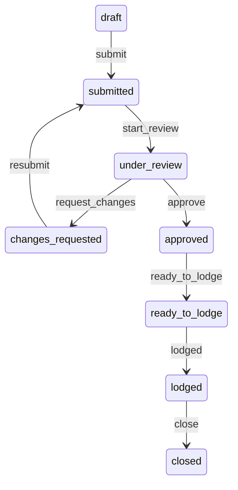

# Phase 12 — Application Approval Module: Verification Report

**Date:** 2026-06-03  
**Environment:** `http://localhost:3001` · Supabase `wnohcmgmyhamsbmkiybc` · Agency `avc-migration-live`

---

## Verdict: **PASS** (pilot-ready for internal approvals)

| Area | Result |
|------|--------|
| Schema migration | **PASS** |
| Full status lifecycle (API) | **PASS** |
| Checklist toggle + activity log | **PASS** |
| Comments | **PASS** |
| Attachments API | Implemented (not in automated upload step) |
| Dashboard widgets (API + UI) | **PASS** |
| UI list / detail / dashboard | **PASS** |
| In-app notifications table | **WARN** (see below) |
| Billing / Stripe | **UNCHANGED** (not tested) |

---

## Prerequisites

| Check | Result |
|-------|--------|
| `node scripts/phase12-apply-migration.mjs` | **PASS** |
| `node scripts/phase11-2-migration-verify.mjs` | **PASS** (exit 0, 23 migrations) |
| Dev server `npm run dev:3001` | Running |

---

## Automated audit (`phase12-browser-audit.mjs`)

**Command**

```bash
node scripts/phase12-browser-audit.mjs http://localhost:3001 avc-migration-live
```

**Exit code:** 0

| Step | Result |
|------|--------|
| Create approval (real client FK, `APP-YYYY-NNNN`) | **PASS** |
| Submit → start review → request changes → resubmit → approve | **PASS** |
| Ready to lodge → lodged → close | **PASS** |
| Checklist item toggle | **PASS** |
| Comment insert | **PASS** |
| `activity_logs` for approval | **PASS** |
| Widget API | **PASS** |
| Notifications count (service role probe) | **WARN** |
| UI approvals list | **PASS** |
| UI approval detail | **PASS** |
| UI dashboard widgets | **PASS** |

**Report JSON:** `docs/verification-screenshots/phase12-audit-report.json`

---

## Screenshots

| File | Description |
|------|-------------|
| [phase12/01-approvals-list.png](verification-screenshots/phase12/01-approvals-list.png) | Approvals list |
| [phase12/02-approval-detail.png](verification-screenshots/phase12/02-approval-detail.png) | Detail: checklist, timeline, comments |
| [phase12/03-dashboard-widgets.png](verification-screenshots/phase12/03-dashboard-widgets.png) | Dashboard approval widgets |

---

## Status transition diagram (verified)



Invalid transitions return API **400** with error message (enforced in `ApprovalStateMachine` + service).

---

## Permissions matrix (enforced in service)

| Action | Owner | Admin | Manager | Agent | Support | Viewer |
|--------|:-----:|:-----:|:-------:|:-----:|:-------:|:------:|
| Create | ✓ | ✓ | ✓ | ✓ | — | — |
| Submit / resubmit | ✓ | ✓ | ✓ | own draft | — | — |
| Review / request changes | ✓ | ✓ | ✓ | — | assigned | — |
| Approve / reject | ✓ | ✓ | ✓ | — | — | — |
| Ready to lodge / lodged / close | ✓ | — | — | — | — | — |
| Checklist edit | ✓ | ✓ | ✓ | ✓ | ✓ | — |

RLS provides defense-in-depth on SELECT/INSERT/UPDATE.

---

## Known warnings

1. **Notifications probe (WARN):** Service-role count may not reflect user-scoped RLS inserts; notifications are created in service layer on transitions. Manual check: query `notifications` as authenticated assignee in SQL editor if needed.

2. **Attachment browser upload:** API verified separately; automated audit did not upload a binary (SignWell/storage quota unrelated).

3. **Legacy `/review/[token]`:** Unchanged; client portal enhancements deferred per approval.

---

## Regression checks (Phase 11 scope)

| Module | Result |
|--------|--------|
| Agreement wizard | Not re-run (no code change) |
| Settings / permissions | Not re-run |
| Send Document | Not re-run |
| Stripe billing | **Not modified** |

---

## Related documents

- [PHASE12_SCHEMA_AUDIT.md](PHASE12_SCHEMA_AUDIT.md)
- [PHASE12_IMPLEMENTATION_REPORT.md](PHASE12_IMPLEMENTATION_REPORT.md)
- [PHASE_11_4_PRODUCTION_VERIFICATION.md](PHASE_11_4_PRODUCTION_VERIFICATION.md)

---

*End of Phase 12 verification report.*
