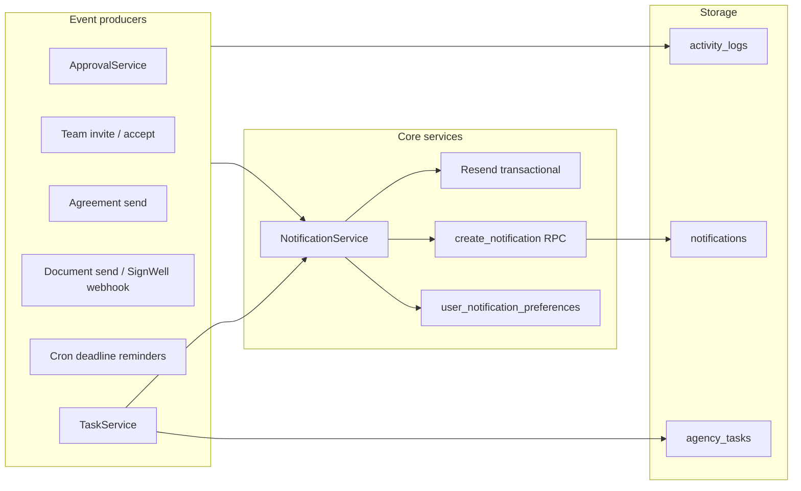

# Phase 13 — Notification & Communications Architecture

**Date:** 2026-06-03  
**Scope:** Unified notifications, email (Resend), preferences, activity feed, tasks, search, deadlines  
**Out of scope:** Billing, Stripe, approval workflow redesign

---

## Design principles

1. **Single notification pipeline** — all in-app alerts flow through `NotificationService` → `notifications` table (via `create_notification` RPC).
2. **Single activity pipeline** — audit timeline uses existing `activity_logs` only.
3. **Preference-gated delivery** — `user_notification_preferences` controls email and in-app per category.
4. **Agency isolation** — RLS + `get_tenant()` on all tables; search and feeds filter by `agency_id`.

---

## Data model

### `notifications` (extended)

| Column | Purpose |
|--------|---------|
| `type` | `notification_type` enum: agreement, approval, team, reminder, system, billing, document, … |
| `entity_type` / `entity_id` | Link to record |
| `actor_id` | Who triggered the event |
| `action_url` | Deep link (workspace path) |

### `user_notification_preferences`

Per `(user_id, agency_id)` — master switches + per-category email/in-app flags.

### `agency_tasks`

Lightweight tasks: `pending` → `in_progress` → `completed` / `cancelled`, optional `entity_type` / `entity_id` link.

### `application_approvals` (reminders)

| Column | Purpose |
|--------|---------|
| `reminder_at` | Optional manual reminder |
| `escalation_at` | Escalation timestamp |
| `reminders_sent` | JSON flags: `7d`, `3d`, `1d`, `overdue` |

---

## API surface

| Endpoint | Purpose |
|----------|---------|
| `GET /api/notifications` | Paginated list, `type` filter |
| `GET /api/notifications/unread` | Unread count (bell badge) |
| `POST /api/notifications/read-all` | Mark all read |
| `PATCH /api/notifications/[id]` | Mark one read |
| `GET/PATCH /api/settings/notification-preferences` | User prefs |
| `GET /api/activity` | Agency activity feed |
| `GET/POST /api/tasks`, `PATCH /api/tasks/[id]` | Tasks |
| `GET /api/search?q=` | Global search |
| `GET /api/dashboard/summary` | Dashboard widgets |
| `POST /api/cron/deadline-reminders` | Due-date reminders (cron secret) |

---

## UI components

| Component | Location |
|-----------|----------|
| `NotificationCenter` | Header bell + drawer (filter, mark read, 30s poll) |
| `NotificationPreferencesPanel` | Settings → Notifications |
| `DashboardCommunications` | Dashboard workload widgets |
| `ActivityFeedPage` | `/workspace/[agency]/activity` |
| `CommandPalette` | Ctrl+K search + navigation |

---

## Email mapping (Resend)

| Event | Category | Template |
|-------|----------|----------|
| Approval assigned / changes / approved / rejected / lodge / close | `approval` | HTML via `buildApprovalEmailHtml` |
| Agreement sent | `agreement` | Transactional HTML |
| Document sent / signed | `document` | Transactional HTML |
| Team joined | `team` | Transactional HTML |
| Deadline reminders | `reminder` | Transactional HTML |
| Task assigned | `system` | Transactional HTML |

Team invite email remains in `POST /api/team/invite` (unchanged flow).

---

## Mentions

Comments with `@handle` resolve users in agency by email local-part or normalized `full_name`. Mentioned users receive `comment` category notification + email if enabled.

---

## Security

- Notifications: users SELECT/UPDATE own rows only (existing RLS).
- Inserts: `create_notification` SECURITY DEFINER validates `user_id` ∈ `agency_id`.
- Cron: `x-cron-secret` header required for deadline job.
- Search/tasks/activity: `getWorkspaceApiContext()` enforces authenticated agency membership.

---

## Related documents

- [PHASE13_IMPLEMENTATION_REPORT.md](PHASE13_IMPLEMENTATION_REPORT.md)
- [PHASE13_VERIFICATION_REPORT.md](PHASE13_VERIFICATION_REPORT.md)
- [PHASE12_IMPLEMENTATION_REPORT.md](PHASE12_IMPLEMENTATION_REPORT.md)
