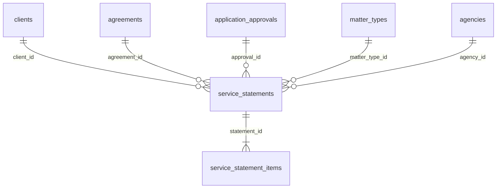

# Statement of Service Architecture (Phase 16E)

**Date:** 2026-06-03  
**Status:** Foundation only — **do not build final UI module yet**

---

## Purpose

A Statement of Service (SoS) documents professional services rendered after:

```
Client → Agreement → Application Approval → Statement of Service → Invoice (future)
```

All identity and matter context must **derive from existing FKs**, never re-entered.

---

## Tables (migration `20260606100000_phase16_security_foundation.sql`)

### `service_statements`

| Column | Type | Purpose |
|--------|------|---------|
| `id` | UUID | Primary key |
| `agency_id` | UUID FK | Tenant |
| `client_id` | UUID FK | Required source client |
| `agreement_id` | UUID FK | Optional linked agreement |
| `approval_id` | UUID FK | Optional linked approval |
| `matter_type_id` | UUID FK | Matter classification |
| `statement_number` | TEXT | Agency-sequenced ref |
| `status` | TEXT | `draft` → `issued` → `void` |
| `visa_subclass` | TEXT | Snapshot from matter/approval |
| `matter_reference` | TEXT | File ref |
| `issued_at` | TIMESTAMPTZ | When issued to client |
| `metadata` | JSONB | Issued snapshot (names for PDF only) |
| `created_by` | UUID FK | Agent |
| `deleted_at` | TIMESTAMPTZ | Soft delete |

### `service_statement_items`

| Column | Type | Purpose |
|--------|------|---------|
| `id` | UUID | Primary key |
| `statement_id` | UUID FK | Parent |
| `agency_id` | UUID FK | Tenant RLS |
| `line_type` | TEXT | `service`, `disbursement`, `adjustment` |
| `description` | TEXT | Line label |
| `quantity` | NUMERIC | Units |
| `unit_amount` | NUMERIC | Price |
| `sort_order` | INT | Display order |

---

## Relationships



---

## Workflow (future module)

1. **Initiate** from Approval detail or Agreement detail (button: "Create statement").
2. **Prefill** lines from:
   - Agreement `metadata` fees / payment schedule
   - Approval fee fields if present
3. **Draft** — agent adjusts quantities only; client block is read-only from `clients` join.
4. **Issue** — PDF generation; `issued_at` set; `metadata.client_snapshot` frozen for legal record.
5. **Invoice** (future) — Stripe/Xero integration reads `service_statement_items` totals.

---

## Client-centric rules

| Rule | Enforcement |
|------|-------------|
| No manual client name on SoS form | UI reads `clients.name` |
| No manual email | `clients.email` |
| Subclass from matter | `matter_types` or approval `visa_subclass` |
| Agent attribution | `created_by` → `users` / RMA record |

---

## RLS

Both tables use `agency_id = get_tenant()` policies (same pattern as agreements).

---

## Future invoice integration

| Step | Integration |
|------|-------------|
| 1 | Sum `service_statement_items` → `total_amount` on statement |
| 2 | Create draft invoice record (new `invoices` table, not yet created) |
| 3 | Link `invoice.statement_id` |
| 4 | Stripe invoice or external accounting webhook |

Environment variables (`STRIPE_*`) remain **ImmiSign-named** until rebrand migration (see `IMMIMATE_REBRAND_PLAN.md`).

---

## Implementation status

| Item | Status |
|------|--------|
| Schema migration file | **PASS** (code) |
| Migration applied to prod DB | **UNKNOWN** — run `supabase db push` |
| API routes | **FAIL** — not built |
| UI | **FAIL** — intentionally deferred |
| E2E | **FAIL** |

**Phase 16E: PARTIAL** (architecture + schema only).
