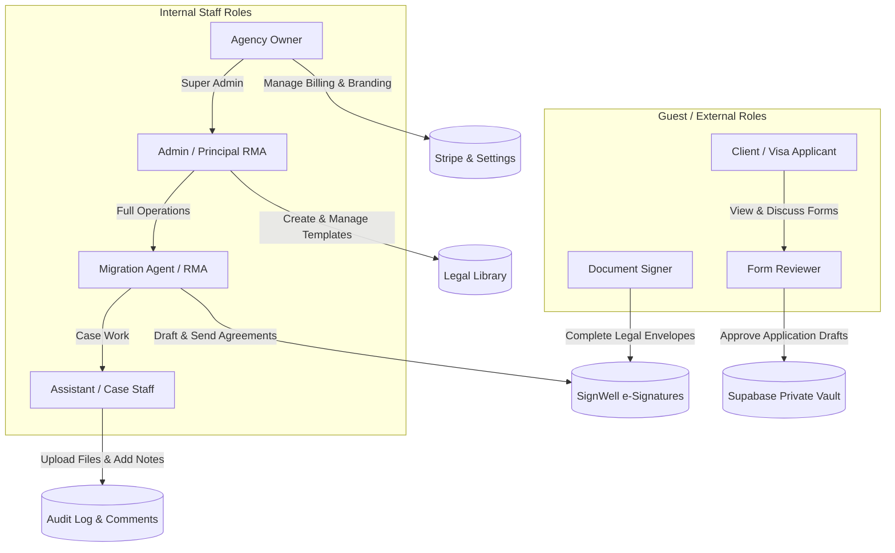
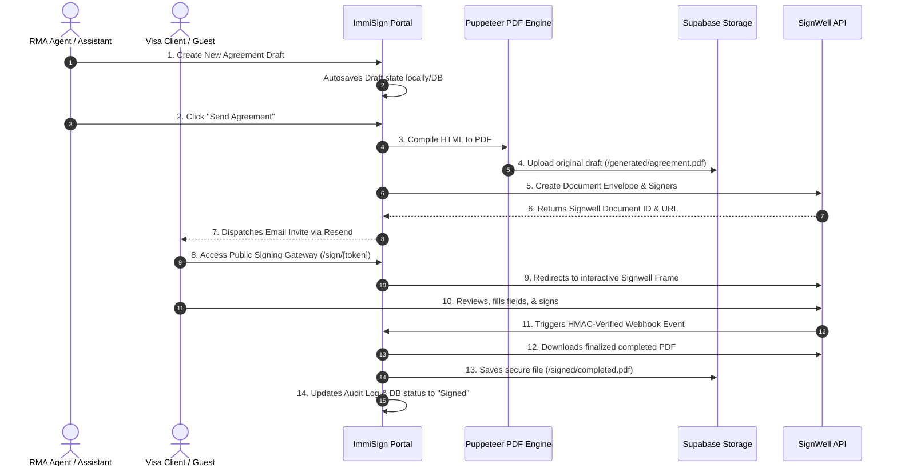

# ImmiSign Complete User Journey Report

This document outlines the detailed workflows, navigations, actions, and permissions of every user role interacting with **ImmiSign**. Use this guide to manually test each account perspective, trace document lifecycles, and understand exactly what features are implemented vs. mocked.

---

## 1. Role Permission Diagram

This diagram visualizes how application credentials flow and which roles hold capabilities across the platform.

---

## 2. Dynamic UI Flow & Navigation Diagram

This diagram maps the path a document takes from draft creation to complete execution, and how the pages are structured.

---

## 3. Comprehensive User Journeys by Role

---

### I. Agency Owner Journey

The Agency Owner represents the practice manager or principal solicitor. They have absolute administrative authority, control licensing settings, billing plans, and global compliance templates.

*   **Login Flow**: 
    1. Direct route to `/login`.
    2. Enters administrator credentials or relies on Safe Development Mode bypass.
    3. Multi-Factor Authentication (MFA) check active in dashboard settings.
    4. Automatically assigned to their primary Workspace/Agency with `Owner` privileges.
*   **Navigation Menu**:
    *   **Dashboard** (`/workspace/[slug]/dashboard`)
    *   **Agreements** (`/workspace/[slug]/agreements`)
    *   **App Approvals** (`/workspace/[slug]/application-approvals`)
    *   **Send Document** (`/workspace/[slug]/documents/send`)
    *   **Document Library** (`/workspace/[slug]/documents/library`)
    *   **Templates** (`/workspace/[slug]/templates`)
    *   **Clients** (`/workspace/[slug]/clients`)
    *   **Reports** (`/workspace/[slug]/reports`)
    *   **Analytics** (`/workspace/[slug]/analytics`)
    *   **Settings** (`/workspace/[slug]/settings`) — *Unrestricted*
    *   **Billing** (`/workspace/[slug]/billing`) — *Unrestricted*
*   **Available Pages**: All implemented dashboard pages, modal overlays, invoice builders, and database configuration settings.
*   **Available Actions**:
    *   **Billing Setup**: Access, change, upgrade, or cancel SaaS plans (Stripe integration); view previous payments.
    *   **Branding Configuration**: Alter corporate color theme accents, logo image assets, and dynamic sidebar initials.
    *   **Team Invitation**: Invite new practitioners, assign security roles (`Migration Agent`, `Assistant`), and revoke active staff credentials.
    *   **Boilerplate Library**: Create, delete, or edit OMARA legal compliance clauses in the database library.
    *   **Override Sign-off**: Manually override, delete, or void any agreements or approval applications across the tenant agency.
*   **Permissions**: `Full Admin Read-Write Access` across all modules. Can bypass normal RLS constraints when configuring system boundaries.
*   **Emails Received**:
    *   Welcome onboarding confirmations.
    *   Stripe payment/invoice receipts.
    *   Daily digest updates on signed packets and pending applications.
*   **Documents Visible**: All agreements, audit trials, scanned visa forms, and signatures generated by all staff in the agency.
*   **End-to-End Workflow**:
    > **Onboard Agency** ➔ **Set Brand Theme** ➔ **Invite Team Members** ➔ **Create Compliance Clauses** ➔ **Monitor Practice Performance Logs**

---

### II. Migration Agent / RMA Journey

The Registered Migration Agent (RMA) is the primary case practitioner. They generate client agreements, build Department of Home Affairs application forms, send documents for review, and interact with the audit log.

*   **Login Flow**:
    1. Standard `/login` route.
    2. Logged in and matched against their designated `agency_id`.
    3. Assigned standard case-practitioner navigation permissions.
*   **Navigation Menu**:
    *   **Dashboard** (`/workspace/[slug]/dashboard`)
    *   **Agreements** (`/workspace/[slug]/agreements`)
    *   **App Approvals** (`/workspace/[slug]/application-approvals`)
    *   **Send Document** (`/workspace/[slug]/documents/send`)
    *   **Document Library** (`/workspace/[slug]/documents/library`)
    *   **Templates** (`/workspace/[slug]/templates`)
    *   **Clients** (`/workspace/[slug]/clients`)
    *   **Reports** (`/workspace/[slug]/reports`)
    *   **Analytics** (`/workspace/[slug]/analytics`)
    *   **Settings** (`/workspace/[slug]/settings`) — *Locked out of Team setup, Brand, & Billing tabs*
    *   **Billing** — *Locked/Hidden (Read-only prompt shown)*
*   **Available Pages**: Standard workspace pages. Setting options are restricted (MFA and Personal Profile tabs are writable).
*   **Available Actions**:
    *   **Draft Agreements**: Configure matter subclasses, scope of work, and billing milestones.
    *   **Signature Dispatch**: Generate PDF drafts via Puppeteer and dispatch signing packets to SignWell.
    *   **Submit Review Request**: Upload client visa form drafts, map checking checklists, and send private review tokens to clients.
    *   **Timeline Logs**: Read and append custom compliance notes to the centralized activity timeline.
*   **Permissions**: `Read-Write Case Practitioner Access`. Restrained from modifying company structure, billing, or inviting staff.
*   **Emails Received**:
    *   "Document opened by Client" notification alerts.
    *   "E-Signature completed" confirmations (with signed PDF attached).
    *   "Changes Requested" alerts from client review portals.
*   **Documents Visible**: Agreements, Client profiles, Visa forms, and completed signatures under their specific agency assignment (or case team).
*   **End-to-End Workflow**:
    > **Register Client** ➔ **Draft & Generate Agreement PDF** ➔ **Deploy SignWell Envelope** ➔ **Upload Lodgement Draft** ➔ **Review Client Comments** ➔ **Lodge to DHA**

---

### III. Assistant / Case Staff Journey

Assistants prepare document dossiers, fill out client biographical details, and scan supporting visa documentation. They aid RMAs but cannot legally authorize document submissions or initiate contracts.

*   **Login Flow**:
    1. Authenticates through standard secure portal.
    2. Loaded into their agency dashboard workspace.
*   **Navigation Menu**:
    *   **Dashboard**
    *   **Agreements**
    *   **App Approvals**
    *   **Send Document** — *Read-only drafting*
    *   **Document Library**
    *   **Templates** — *Read-only viewing*
    *   **Clients**
    *   **Reports**
    *   *Locked*: **Settings**, **Billing**, and **Analytics**
*   **Available Pages**: Dashboard and list tables. Detail screens allow adding supporting records but block primary action commands.
*   **Available Actions**:
    *   **Compile Case Info**: Key in client personal data, telephone numbers, visa subclasses, and priorities.
    *   **Upload PDF Attachments**: Upload supplementary passport copies, language translations, and bank evidence to the document library.
    *   **Log Activity**: File internal check markers (e.g. "I confirm travel histories are added").
*   **Permissions**: `Restricted Read-Write Case Assistant Access`. Blocked from sending agreements via SignWell, submitting applications for client approval sign-off, deleting files, or changing templates.
*   **Emails Received**:
    *   Assignment alerts when a Migration Agent delegates a case folder for biographical data compilation.
*   **Documents Visible**: General client dossiers and draft documents in their assigned case groups.
*   **End-to-End Workflow**:
    > **Open Case Folder** ➔ **Populate Client Metadata** ➔ **Upload Proof Files** ➔ **Check Biographical Forms** ➔ **Hand off to RMA for Review**

---

### IV. Client Journey

The Client is the visa applicant. They interact with public interfaces to upload credentials, review visa lodgement packs, write remarks, and approve or reject submissions.

*   **Login Flow**:
    *   *No Account Requirement*: Clients access secure, unauthenticated guest portals using a unique, cryptographically strong `review_token` generated for their application.
    *   *Route base*: `/workspace/[slug]/application-approvals/[token]`.
*   **Navigation Menu**:
    *   *Custom Minimal Portal Navigation*: Only displays the active **Document Viewer**, **Review Timeline**, and **Approval/Request Changes Action Bar**.
*   **Available Pages**: Public Application Review page.
*   **Available Actions**:
    *   **PDF Interactive Preview**: Scroll, zoom, and inspect generated Department of Home Affairs forms page-by-page.
    *   **Request Changes**: Pin comments and specific corrections (e.g., "Correct my passport spelling on page 2") to the compliance review pane.
    *   **Compliance Approvals**: Accept and check legal declarations, tick off statements of truth, and click "Approve Form".
*   **Permissions**: `Unauthenticated Token-Bound Guest Access`. Locked to their specific application ID. Bypasses RLS strictly through secure service-role actions that limit access to their single folder.
*   **Emails Received**:
    *   "Action Required: Review your Partner Visa Application" containing the secure access link.
    *   "Application Approved" confirmation receipts.
*   **Documents Visible**: Only the specific PDF forms uploaded for their direct approval review by their RMA.
*   **End-to-End Workflow**:
    > **Open Email Invitation** ➔ **Audits PDF Draft** ➔ **Request Corrections** ➔ **Re-audits Revise** ➔ **Affirms Declarations** ➔ **Submits Approve**

---

### V. Signer Journey

The Signer is an external guest (visa applicant, co-applicant, or corporate sponsor) who signs legal service agreements and retainer contracts.

*   **Login Flow**:
    *   Redirected directly from secure email invitations to the SignWell envelope portal or a token-bound signing route.
    *   *Route base*: `/sign/[token]`.
*   **Navigation Menu**: None. Standard SignWell-hosted interactive framework or custom modal frame.
*   **Available Pages**: Document signature layout frame.
*   **Available Actions**:
    *   **Scroll & Audit Agreement**: Read scope, pricing structures, and jurisdiction disclaimers.
    *   **Signature Execution**: Type, draw, or upload their signature into designated, pre-mapped compliance input boxes.
    *   **Accept Terms**: Complete the legally-binding e-signature loop.
*   **Permissions**: Guest signature clearance matching the specific SignWell envelope ID.
*   **Emails Received**:
    *   "Signature Required on Service Agreement" dispatch from SignWell.
    *   "Document Completed" email with the executed, SHA-256 hashed PDF attached.
*   **Documents Visible**: The specific service agreement they are requested to sign.
*   **End-to-End Workflow**:
    > **Opens Secure Sign Link** ➔ **Reads Contract Scope & Fees** ➔ **Inputs Signature Box** ➔ **Finalizes Signing Envelope** ➔ **Downloads PDF Copy**

---

### VI. Reviewer Journey

The Reviewer is a specialized client auditor or sponsor who cross-checks visa applications for completeness and accuracy prior to final agency lodgement.

*   **Login Flow**: Same as the Client, using a secure, cryptographically-generated token.
    *   *Route*: `/workspace/[slug]/application-approvals/[token]`.
*   **Navigation Menu**: Custom review portal interface.
*   **Available Pages**: Application review, comments log, and step checklist.
*   **Available Actions**:
    *   **Checklist Auditing**: Click and mark verification checklists (e.g. "I confirm all travel history details are complete").
    *   **Biographical Review**: Audit personal details across multi-page visa drafts.
    *   **Decline with Comments**: Flag discrepancies back to the case manager.
*   **Permissions**: Guest review clearance restricted to their associated token ID.
*   **Emails Received**:
    *   "Review Requested: Please confirm your visa application details" containing their private access token.
*   **Documents Visible**: The visa application documents and supplementary evidence sheets sent for review.
*   **End-to-End Workflow**:
    > **Open Review Link** ➔ **Audits Checked Checklist Items** ➔ **Flags Discrepancies** ➔ **Approves Final Copy**

---

## 4. Current Feature Matrix

This matrix describes what components are fully active, partially implemented, mocked, or currently absent.

| Feature Area | Component / Subsystem | Status | Implementation Details |
| :--- | :--- | :--- | :--- |
| **Multi-Tenancy & RLS** | Database isolation, tenant route prefixes, table structures. | **Implemented** | RLS is active on all tables. Route structure enforces `/workspace/[agency]` split. |
| | Cross-tenant security middleware validation. | **Implemented** | Enforces boundary checks on standard API and page routing. |
| **Agreements Engine** | HTML-to-PDF compiler pipeline. | **Implemented** | RLS verified. Uses serverless `@sparticuz/chromium` + `puppeteer-core`. |
| | Local Chrome path fallback detection. | **Implemented** | Detects developer OS and invokes native Google Chrome automatically. |
| | Agreement templates library database schemas. | **Implemented** | Fully mapped in schema; accessible via repository layers. |
| **SignWell Integration** | SignWell Client REST wrapper. | **Implemented** | Provides retry-logic for envelope dispatch and PDF downloading. |
| | Processed webhooks tracking table. | **Implemented** | Webhook idempotency database keys map unique webhook IDs. |
| | Dual-version compliance storage. | **Implemented** | Keeps separate `/generated/agreement.pdf` and `/signed/completed.pdf`. |
| | Token-bound guest route portals (`/sign/[token]`). | **Implemented** | Creates lightweight route mapping for upcoming client portal pages. |
| **App Approvals** | Comments, timeline, audit logs database tracking. | **Implemented** | Shared centralized `audit_log` system logs approval events. |
| | Versioning updates & revision indicators. | **Implemented** | Tracks `version_number` and `revision_count` variables during updates. |
| | Public token review endpoints. | **Implemented** | Exposes secure unauthenticated route bypass for client reviews. |
| | Live Web-socket activity notification stream. | **Partially Implemented** | Employs periodic polling; real-time push streams require live database configurations. |
| **Billing (Stripe)** | Corporate Plans config tables & price mappings. | **Implemented** | Starter, Pro, and Agency plans fully mapped in system. |
| | Stripe Webhook routes. | **Implemented** | Listens for client subscriptions updates and completed checkout events. |
| | Dev Mode billing sandbox bypass. | **Mocked** | Bypasses actual Stripe gateways in Safe Dev Mode, routing to mock users. |
| **Mailing (Resend)** | React Email templates. | **Implemented** | Implements custom layouts for templates (agreements, invitations, billing). |
| | Transitional mail queue database logs (`email_jobs`). | **Implemented** | Emails written to queue first, avoiding synchronous timeouts. |
| | Developer mail redirection sandbox. | **Mocked** | Sandbox fallbacks prevent accidental deliveries during dev validation. |

---

## 5. Staging Environment Manual Testing Plan

To manually test all implemented user roles inside your developer sandbox, follow these testing configurations.

### How to Toggle Roles in the Workspace Sandbox:
1. Open the sidebar navigation menu in any dashboard view (`/workspace/[slug]/dashboard`).
2. Navigate to the **Developer Simulator Panel** located at the bottom-left of the screen.
3. Click the role selector dropdown.
4. Select the target role you want to preview (e.g. `Assistant`, `Migration Agent`, `Owner`).
5. The platform layout, page access limits, and action options will dynamically refresh to show you exactly what that user level is allowed to see and do.

### Recommended Test Cases to Run:
- **Test Case 1**: Switch to **Assistant**. Navigate to **Settings** (`/settings`) or **Billing** (`/billing`). Ensure the lock banners display and team invites are locked.
- **Test Case 2**: Switch to **Migration Agent**. Create a new agreement under **Agreements** (`/agreements/new`). Check if the autosave indicator updates.
- **Test Case 3**: Switch to **Owner**. Verify that all tabs under Settings (Team, Branding, Clauses) are writable. Verify team members can have their roles updated.
- **Test Case 4**: Simulate a client review. Retrieve a cryptographically strong `review_token` from an approval item. Open it in a separate private browser window (`/workspace/[slug]/application-approvals/[token]`). Verify the restricted, client-friendly document viewer launches successfully.
